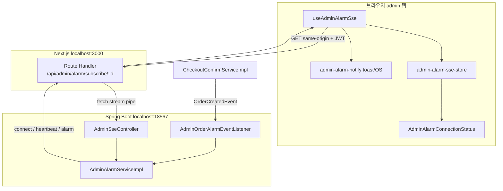
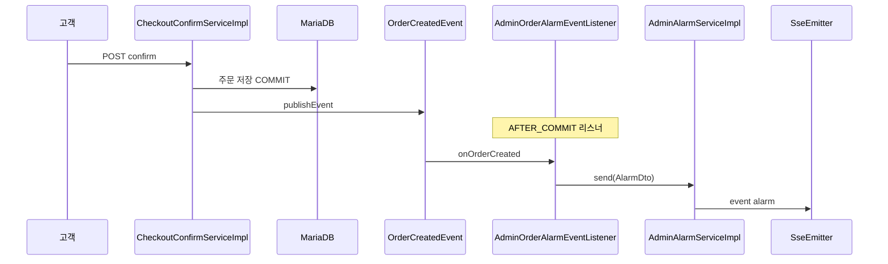
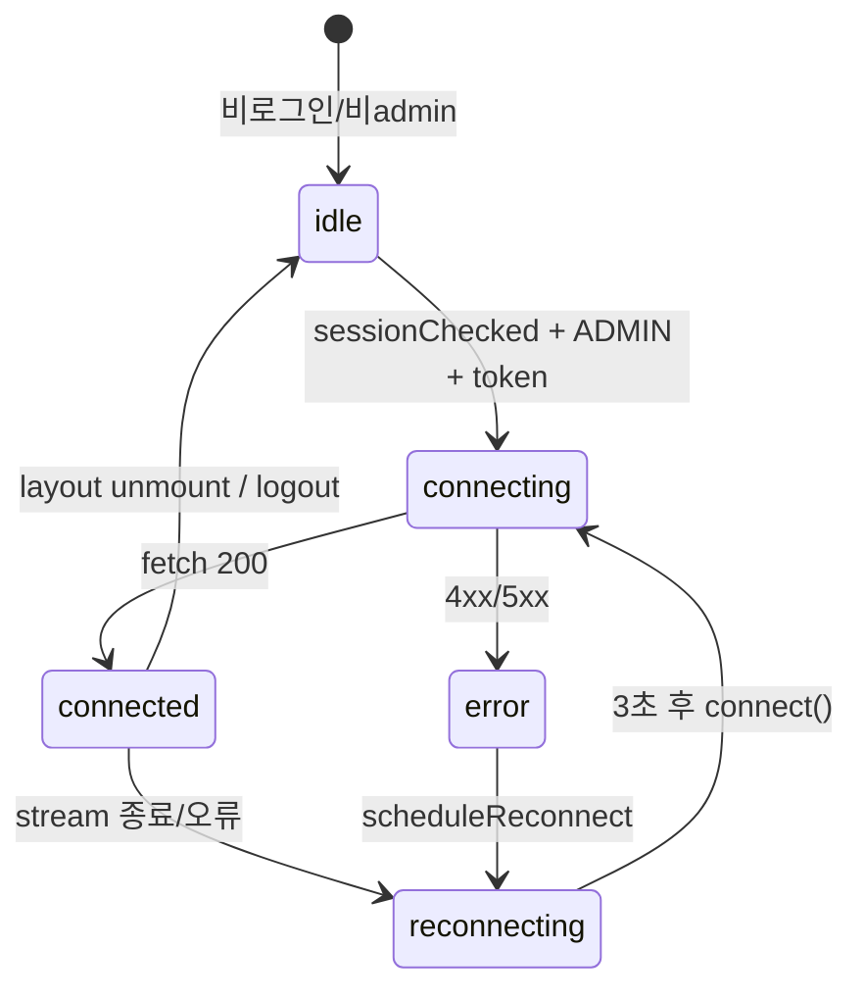

# Admin SSE 주문 알림 구현 보고서

본 문서는 **관리자(admin) 페이지에서 새 주문이 들어오면 실시간으로 알림을 받는 기능**의 기술 배경, 전체 흐름, 코드 구조를 정리한 학습용 보고서입니다. SSE(Server-Sent Events)를 처음 접하는 경우 **1장 → 2장 → 5장** 순서로 읽는 것을 권장합니다.

---

## 1. 이 기능이 하는 일


| 구분    | 내용                                                              |
| ----- | --------------------------------------------------------------- |
| 목표    | 관리자가 admin 화면을 보고 있는 동안 **새 주문이 생성되면 즉시** toast(또는 OS 알림)로 알려 줌 |
| 대상    | `ROLE_ADMIN` 권한 사용자, admin layout이 마운트된 탭                       |
| 트리거   | 고객 결제 확정 → 주문 DB 저장 → `OrderCreatedEvent` 발행                    |
| 전달 방식 | **SSE** (HTTP 연결을 오래 유지하고, 서버가 이벤트를 밀어 넣음)                      |


관리자가 주문 목록을 **주기적으로 새로고침하지 않아도** 서버가 “새 주문” 메시지를 push합니다.

---

## 2. SSE 기초 (왜 쓰는가)

### 2.1 실시간 알림을 만드는 대표 방법


| 방식              | 설명                                    | 장점                      | 단점                           |
| --------------- | ------------------------------------- | ----------------------- | ---------------------------- |
| **폴링(Polling)** | 클라이언트가 N초마다 API 호출                    | 구현 단순                   | 지연·불필요한 요청·서버 부하             |
| **SSE**         | HTTP GET 한 번 → 연결 유지 → 서버가 텍스트 이벤트 전송 | 단방향(서버→클라)에 적합, HTTP 기반 | 클라이언트→서버 전송에는 부적합            |
| **WebSocket**   | 양방향 전용 프로토콜                           | 채팅·게임 등 양방향에 강함         | 인프라·프록시 설정이 SSE보다 까다로운 경우 많음 |


**새 주문 알림**은 “서버 → admin 브라우저” **단방향**이면 충분하므로 SSE가 적합합니다.

### 2.2 SSE 메시지 형식

SSE는 **평문 텍스트**를 `Content-Type: text/event-stream` 으로 스트리밍합니다. 이벤트 하나는 대략 아래 형태입니다.

```
event:alarm
data:{"title":"새로운 주문이 들어왔습니다.","content":"...","link":"/admin/order/detail/57"}

```

- `event:` — 이벤트 이름 (없으면 `message`)
- `data:` — 페이로드 (여러 줄 가능)
- **빈 줄(`\n\n`)** — 한 이벤트의 끝

Spring `SseEmitter`가 위 형식으로 변환해 보냅니다.

### 2.3 브라우저에서 SSE 받는 방법


| API                            | Authorization 헤더       | 비고          |
| ------------------------------ | ---------------------- | ----------- |
| `EventSource`                  | **불가** (표준상 커스텀 헤더 제한) | JWT 붙이기 어려움 |
| `**fetch` + `ReadableStream`** | **가능**                 | 본 프로젝트 채택   |


JWT(`Authorization: Bearer …`)가 필요하므로 `**fetch`로 스트림 body를 직접 읽는 방식**을 사용합니다.

---

## 3. 전체 아키텍처




**핵심:** 브라우저는 **항상 `localhost:3000`(same-origin)** 으로만 SSE를 연결합니다. Next.js Route Handler가 백엔드(`127.0.0.1:18567`) 스트림을 **그대로 pipe**합니다.

---

## 4. 왜 same-origin 프록시를 쓰는가

로컬 개발 시 프론트(3000)와 API(18567)는 **origin이 다릅니다.** 브라우저에서 API로 직접 SSE를 열면 **CORS preflight(OPTIONS)** 가 필요합니다.

본 프로젝트에서 겪은 문제:


| 시도                                             | 결과                                      |
| ---------------------------------------------- | --------------------------------------- |
| `localhost:3000` → `localhost:18567` 직접 fetch  | CORS 차단 (`Failed to fetch`)             |
| `next.config` rewrite로 `/api/`* 전부 프록시         | SSE 스트림 **버퍼링·500** (`Failed to proxy`) |
| **Route Handler 전용 프록시 + rewrite에서 SSE 경로 제외** | 정상 동작                                   |


따라서:

1. 브라우저 URL: `/api/admin/alarm/subscribe/{connectionId}` (same-origin)
2. `[frontend/src/app/api/admin/alarm/subscribe/[connectionId]/route.ts](../frontend/src/app/api/admin/alarm/subscribe/[connectionId]/route.ts)` — Node `fetch`로 백엔드 SSE 수신 후 `Response(body)`로 pipe
3. `[frontend/next.config.mjs](../frontend/next.config.mjs)` — rewrite 패턴에서 `admin/alarm/subscribe` **제외**

```javascript
// SSE만 rewrite 대상에서 빼고, Route Handler가 처리
source: "/api/:path((?!admin/alarm/subscribe).*)"
```

---

## 5. 이벤트 종류와 계약

### 5.1 서버 → 클라이언트 이벤트


| event 이름    | 주기/시점    | data 예시         | 프론트 처리                               |
| ----------- | -------- | --------------- | ------------------------------------ |
| `connect`   | 구독 직후 1회 | `connected`     | HTTP 200 시 이미 “연결됨” 처리 (별도 UI 갱신 없음) |
| `heartbeat` | 30초마다    | `ping`          | 연결 생존 확인, 헤더 배지 `hb` 갱신              |
| `alarm`     | 주문 생성 시  | JSON `AlarmDto` | toast / OS 알림, 주문 상세 링크              |


### 5.2 Alarm JSON (`AlarmDto` / `Alarm`)

```json
{
  "title": "새로운 주문이 들어왔습니다.",
  "content": "새로운 주문이 들어왔습니다. 확인해주세요.",
  "link": "/admin/order/detail/57"
}
```

---

## 6. 백엔드 로직

### 6.1 패키지 위치

```
backend/src/main/java/com/shop/admin/alarm/
├── controller/AdminSseController.java
├── service/AdminAlarmService.java
├── service/AdminAlarmServiceImpl.java
├── listener/AdminOrderAlarmEventListener.java
└── dto/AlarmDto.java
```

### 6.2 주문 생성 → 알림까지




- `[CheckoutConfirmServiceImpl](../backend/src/main/java/com/shop/checkout/service/CheckoutConfirmServiceImpl.java)` — 확정 성공 후 `OrderCreatedEvent` 발행
- `[AdminOrderAlarmEventListener](../backend/src/main/java/com/shop/admin/alarm/listener/AdminOrderAlarmEventListener.java)` — `@TransactionalEventListener(AFTER_COMMIT)` 으로 **커밋 후** 알림 (롤백 시 알림 없음)

### 6.3 `AdminAlarmServiceImpl` 핵심

**연결 저장소**

```java
ConcurrentHashMap<Long, SseEmitter> emitters
```

- key: `connectionId` (프론트가 `Date.now()`로 생성한 탭별 ID, **user PK 아님**)
- value: Spring `SseEmitter` (비동기 HTTP 스트림)

**subscribe(connectionId)**

1. 같은 ID의 기존 emitter가 있으면 `complete()` 후 교체
2. timeout **1시간** (`60 * 60 * 1000L`)
3. `onCompletion` / `onTimeout` / `onError`에서 map에서 제거
4. 즉시 `connect` 이벤트 1회 전송

**send(AlarmDto)**

- map에 있는 **모든** admin 탭 연결에 `alarm` 이벤트 broadcast
- admin 탭이 하나도 없으면 WARN 로그 후 skip

**heartbeat (`@Scheduled` 30초)**

- 모든 연결에 `heartbeat` 이벤트 전송
- 프록시·로드밸런서 idle timeout 방지 + 프론트 연결 상태 확인용

**클라이언트 disconnect 로그**

- 새로고침·탭 닫기·재연결 시 `ClientAbortException` 등은 **DEBUG** (정상에 가까움)
- 인증 실패·서버 오류와 구분

### 6.4 API·보안


| 항목           | 값                                               |
| ------------ | ----------------------------------------------- |
| URL          | `GET /api/admin/alarm/subscribe/{connectionId}` |
| Content-Type | `text/event-stream`                             |
| 인증           | JWT + `@PreAuthorize("hasRole('ADMIN')")`       |
| CORS         | 브라우저는 same-origin 프록시 사용 → SSE 구독 시 CORS 불필요    |


---

## 7. 프론트엔드 로직

### 7.1 파일 맵


| 파일                                                                                                       | 역할                                        |
| -------------------------------------------------------------------------------------------------------- | ----------------------------------------- |
| `[useAdminAlarmSse.ts](../frontend/src/app/admin/_hooks/useAdminAlarmSse.ts)`                            | SSE 연결·재연결·이벤트 처리 hook                    |
| `[admin-alarm-sse-url.ts](../frontend/src/lib/admin-alarm-sse-url.ts)`                                   | same-origin 구독 URL 생성                     |
| `[admin-sse-parse.ts](../frontend/src/lib/admin-sse-parse.ts)`                                           | SSE 청크 파싱 (`\n\n` 분리, `event:` / `data:`) |
| `[admin-alarm-sse-store.ts](../frontend/src/stores/admin-alarm-sse-store.ts)`                            | 연결 상태 zustand store                       |
| `[AdminAlarmConnectionStatus.tsx](../frontend/src/app/admin/_components/AdminAlarmConnectionStatus.tsx)` | 헤더 SSE 상태 배지                              |
| `[admin-alarm-notify.ts](../frontend/src/lib/admin-alarm-notify.ts)`                                     | sonner toast + Notification API           |
| `[AdminNotificationPrompt.tsx](../frontend/src/app/admin/_components/AdminNotificationPrompt.tsx)`       | OS 알림 권한 요청 버튼                            |
| `[layout.tsx](../frontend/src/app/admin/layout.tsx)`                                                     | admin layout에서 `useAdminAlarmSse()` 호출    |


### 7.2 연결 생명주기 (hook)




**connect() 요약**

1. `connectionId = Date.now()` (재연결마다 **새 ID** → 백엔드 map 충돌 방지)
2. `fetch(/api/admin/alarm/subscribe/{id}, { Authorization, Accept: text/event-stream })`
3. `response.body.getReader()` 로 청크 읽기
4. 버퍼에 쌓았다가 `\n\n` 기준으로 이벤트 단위 파싱
5. `heartbeat` → store 갱신, `alarm` → `showOrderAlarm()`
6. 끊기면 3초 후 재연결 (`AbortController`로 이전 연결 정리)

### 7.3 알림 표시 (toast vs OS)


| 상황                        | 동작                    |
| ------------------------- | --------------------- |
| 탭 활성                      | sonner **toast** (항상) |
| 탭 백그라운드 + Notification 권한 | toast + **OS 알림**     |
| 탭 백그라운드 + 권한 없음           | toast만 (돌아와서 확인)      |


OS 알림은 브라우저 정책상 **사용자 클릭** 후 권한 허용이 필요합니다 (`AdminNotificationPrompt`).

---

## 8. 인증·연결 ID 정리

### 8.1 JWT 흐름

```
브라우저 fetch
  Authorization: Bearer {accessToken}
    → Next Route Handler (authorization 헤더 전달)
      → Spring JwtAuthenticationFilter
        → @PreAuthorize ADMIN 검사
          → SseEmitter 반환
```

### 8.2 connectionId vs userId


| 이름             | 실제 의미                                     |
| -------------- | ----------------------------------------- |
| `connectionId` | 탭·재연결마다 새로 부여하는 **연결 식별자** (`Date.now()`) |
| ~~userId~~     | (과거 변수명) 회원 PK와 **무관** — 리네이밍 완료          |


한 admin이 탭을 2개 열면 emitter가 2개이고, 주문 1건 시 **두 탭 모두** 알림을 받습니다.

---

## 9. 로컬 실행·확인 방법

### 9.1 실행

1. 백엔드: port **18567**
2. 프론트: `npm run build` 후 `npm run start` (또는 `npm run dev`)
3. admin 계정 로그인

### 9.2 정상 동작 체크리스트

- [ ] 헤더 **SSE 연결됨** 표시
- [ ] 30초 이내 **hb** 시간 갱신
- [ ] DevTools Network: `localhost:3000/api/admin/alarm/subscribe/...` — Status **200**, **Pending** 유지
- [ ] 테스트 주문 1건 → toast + **수신 알림 N건** 증가
- [ ] 백엔드 로그: `알림 구독 시작`, 주문 시 `알림 발송 시작: active=1`

### 9.3 자주 보는 증상


| 증상                                   | 흔한 원인                                              |
| ------------------------------------ | -------------------------------------------------- |
| CORS / `Failed to fetch` (18567 URL) | 예전 빌드 또는 API 직접 연결 — **3000 same-origin** 이어야 함    |
| 500 / `Failed to proxy`              | rewrite가 SSE를 가로챔 — `next.config` exclude 확인       |
| SSE 연결 중에서 멈춤                        | 프록시 버퍼링 또는 connect 이벤트 미수신 — Route Handler pipe 확인 |
| 백엔드 `active=0`으로 발송 skip             | admin 탭 SSE 미연결                                    |
| `Client disconnected` WARN           | 새로고침·재연결 — 대개 정상                                   |


---

## 10. 운영(Docker/Nginx) 시 참고


| 항목      | 권장                                                                                   |
| ------- | ------------------------------------------------------------------------------------ |
| 프록시 버퍼링 | `X-Accel-Buffering: no` (Route Handler 응답에 포함)                                       |
| 타임아웃    | SSE 연결은 일반 API보다 길게 (Nginx `proxy_read_timeout` 등)                                   |
| API URL | `NEXT_PUBLIC_API_URL` 설정 시 rewrite 비활성 — SSE Route Handler는 `API_SERVER_URL`로 백엔드 접근 |
| 다중 인스턴스 | in-memory `ConcurrentHashMap`은 **단일 JVM** 기준; 스케일아웃 시 Redis pub/sub 등 별도 설계 필요       |


---

## 11. SSE vs WebSocket — 언제 뭘 쓸까


| 선택             | 적합한 경우                     |
| -------------- | -------------------------- |
| **SSE (본 기능)** | 서버→클라 알림, 대시보드 갱신, 단순 push |
| **WebSocket**  | 채팅, 협업 편집, 고빈도 양방향 메시지     |
| **폴링**         | 실시간성 낮아도 됨, 구현 시간 최소       |


---

## 12. 추가 학습 자료


| 자료                                  | URL                                                                                                                                                                                                              |
| ----------------------------------- | ---------------------------------------------------------------------------------------------------------------------------------------------------------------------------------------------------------------- |
| MDN — Server-sent events            | [https://developer.mozilla.org/en-US/docs/Web/API/Server-sent_events](https://developer.mozilla.org/en-US/docs/Web/API/Server-sent_events)                                                                       |
| MDN — Using readable streams        | [https://developer.mozilla.org/en-US/docs/Web/API/Streams_API/Using_readable_streams](https://developer.mozilla.org/en-US/docs/Web/API/Streams_API/Using_readable_streams)                                       |
| Spring — SseEmitter                 | [https://docs.spring.io/spring-framework/reference/web/webmvc/mvc-ann-async.html](https://docs.spring.io/spring-framework/reference/web/webmvc/mvc-ann-async.html)                                               |
| Spring — TransactionalEventListener | [https://docs.spring.io/spring-framework/reference/data-access/transaction/declarative/annotations.html](https://docs.spring.io/spring-framework/reference/data-access/transaction/declarative/annotations.html) |


---

## 13. 관련 문서

- [CHECKOUT-IMPLEMENTATION-REPORT.md](./CHECKOUT-IMPLEMENTATION-REPORT.md) — 주문 확정 및 `OrderCreatedEvent` 발행 지점
- [PROJECT-IMPLEMENTATION-REPORT.md](./PROJECT-IMPLEMENTATION-REPORT.md) — 프로젝트 전반 구조

---

*작성 기준: admin SSE 알림 기능 클린업 반영본 (same-origin Route Handler 프록시, connectionId 네이밍, listener 패키지)*