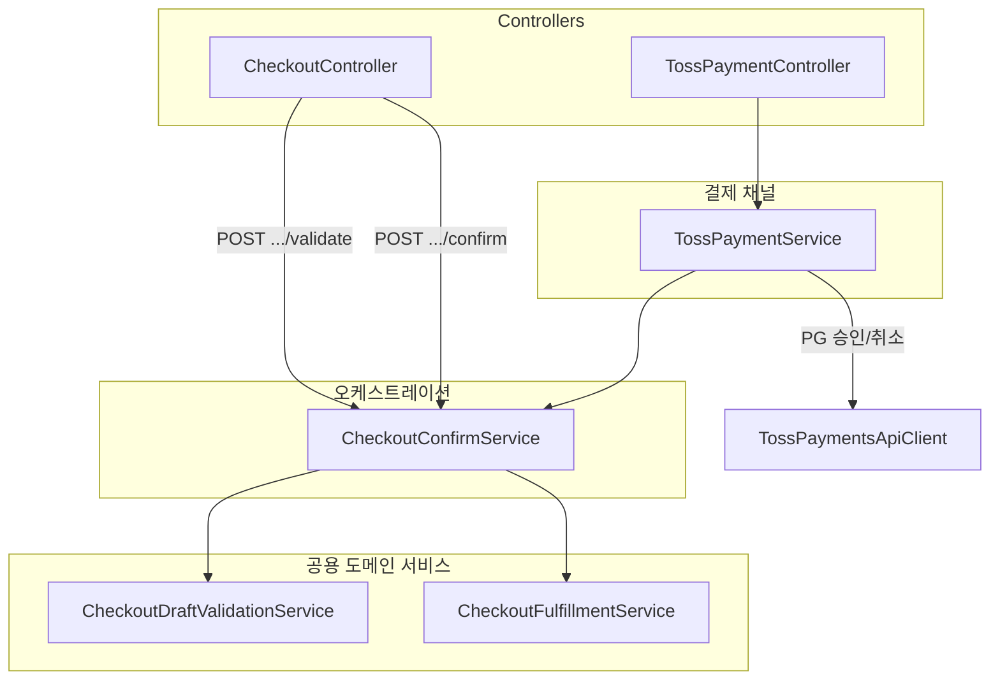

# 체크아웃 확정 3분할 리팩터링 플랜

검증(공용) · 결제 채널(직접/토스) · 풀필먼트(재고·주문 공용)로 `CheckoutConfirmServiceImpl`을 분리한다.

## 목표 아키텍처



| 레이어 | 클래스 | 책임 |
|--------|--------|------|
| 검증 (공용) | `CheckoutDraftValidationService` | 소유자·상태·수령인·라인·금액 불변식 (재고 차감 없음) |
| 풀필먼트 (공용) | `CheckoutFulfillmentService` | 재고 차감, 포인트, 주문 저장, draft CONFIRMED, 카트 정리 |
| 오케스트레이션 | `CheckoutConfirmService` | 멱등 + 검증 + 풀필먼트, 결제 메타 조립 |
| PG 경계 | `TossPaymentService` | 토스 승인/취소; 확정은 `CheckoutConfirmService`에 위임 |

PG API는 `CheckoutConfirmService` 밖에 둔다.

## API

### CheckoutConfirmService

```java
ResponseEntity<?> validateDraft(String draftPublicId, UserIdentity identity);
ResponseEntity<?> confirmDirect(String draftPublicId, UserIdentity identity);
ResponseEntity<?> finalizeAfterPayment(String draftPublicId, UserIdentity identity, CheckoutConfirmContext context);
```

### CheckoutController

- `POST /api/checkout/drafts/{publicId}/validate` — 토스 결제 전 재검증 (신규)
- `POST /api/checkout/drafts/{publicId}/confirm` — 매장 직접결제 (`confirmDirect`, URL 유지)

### TossPaymentService 흐름

1. `validateDraft` (PG 승인 전)
2. `verifyAmount`
3. 토스 Confirm API
4. `finalizeAfterPayment` + 실패 시 자동 취소 (2안)

## 트랜잭션

| 시점 | DB 락 | 검증 | 재고 |
|------|-------|------|------|
| `validateDraft` | 없음 | O | X |
| `confirmDirect` / `finalizeAfterPayment` | FOR UPDATE | O (재검증) | O |

동시 주문 재고 경합은 확정 TX에서만 방어 → 토스 자동 취소(2안) 유지.

## 구현 순서

1. `CheckoutDraftValidationService` 추출
2. `CheckoutFulfillmentService` 추출
3. `CheckoutConfirmService` 오케스트레이터 개편
4. `TossPaymentService` + `CheckoutController` 연동
5. 프론트 `validateDraft` API (`onBeforeTossPayment`)
6. 테스트 갱신

## 유지

- 응답 DTO / HTTP 상태 코드
- `POST .../confirm`, `POST .../toss/confirm` URL
- 토스 자동 취소(2안)
- `CheckoutLineHandlerRegistry` 패턴

## 관리자 주문 취소 — 토스 PG 환불

`AdminOrderServiceImpl.cancelOrder`에서 `PAYMENT_COMPLETED` + `pgTransactionId` 주문은 토스 결제 취소 API를 먼저 호출한다.

- 성공(또는 `ALREADY_CANCELED_PAYMENT`) → `paymentStatus = PAYMENT_CANCELLED` 후 기존 취소 처리
- 실패 → `409 TOSS_REFUND_FAILED`, 주문 상태 유지

관련: `OrderPaymentStatuses`, `TossPaymentsApiClient.cancelPayment`
