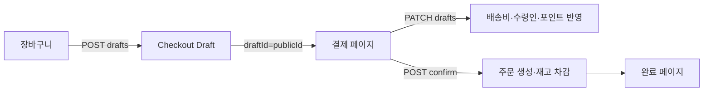

# 결제(Checkout) 및 주문 확정 구현 보고서

본 문서는 장바구니 기반 **결제 초안(draft) 생성 → 결제 페이지 → 주문 확정** 흐름의 구현 내용과 서버 로직을 정리한 기술 보고서입니다. PG(결제대행) 연동 전 단계이며, 확정 API는 내부적으로 결제 완료와 동일하게 주문을 마감합니다.

---

## 1. 목표와 범위

| 구분 | 내용 |
|------|------|
| 목표 | 카트와 분리된 **서버 스냅샷(draft)** 으로 결제 화면을 고정하고, 확정 시 **가격·재고·노출을 재검증**한 뒤 재고 차감 및 주문 생성 |
| 포함 | Draft CRUD(생성·조회·수정), 주문 확정, 재고 조건부 차감, 회원 포인트 차감, 게스트 주문 확인값(6자리), 완료 페이지 |
| 제외 | 실제 카드/계좌 PG 연동, 운영 퍼널 로그·draft 90일 배치 삭제(계획만 존재) |

---

## 2. 사용자 관점 흐름

1. 장바구니에서 **구매** 클릭 → 서버가 현재 카트로 draft 생성 → 브라우저가 `/cart/checkout?draftId=<publicId>` 로 이동합니다.
2. 결제 페이지는 **카트 API가 아니라 draft 조회 API**만 사용합니다. 다른 탭에서 카트를 바꿔도 이 화면의 상품 목록은 바뀌지 않습니다.
3. **주문하기** 시 서버가 금액·재고를 다시 검증하고, 통과하면 주문을 만들고 일치하는 카트 줄만 삭제합니다.

---

## 3. 핵심 설계 원칙

### 3.1 스냅샷과 재검증

- **Draft**는 표시용 고정 데이터(상품명·단가 스냅샷·수량·검색맵·상품 publicId 등)입니다.
- **주문 확정 시**에는 스냅샷을 그대로 신뢰하지 않고, 실제 `CardProduct`·`ProductSearchMap` 기준으로 가격·재고·노출을 다시 확인합니다.
- 단가 불일치(인상·인하 모두) 시 `PRICE_CHANGED`, 재고 부족 시 `OUT_OF_STOCK`, 판매 불가 시 `PRODUCT_UNAVAILABLE` 로 확정을 중단합니다.

### 3.2 금액

- Draft 및 확정 시 **소계·배송비·포인트·최종 금액**은 서버에서 계산합니다. 배송비는 주문 설정(`order_configs`)의 배송비·무료배송 기준을 사용하고, 없으면 코드상 기본값을 사용합니다.
- 매장 수령(`STORE_PICKUP`)은 배송비 0으로 재계산합니다.

### 3.3 동시성·멱등

- 동일 draft에 대한 확정 요청은 **`CheckoutDraft` 행에 대한 비관적 잠금(`SELECT … FOR UPDATE`)** 으로 직렬화하여 이중 주문을 방지합니다.
- 이미 `CONFIRMED` 이고 `confirmedOrderId`가 있으면 **새 주문을 만들지 않고** 기존 주문 결과를 반환합니다(중복 클릭·재시도 멱등).
- 재고 차감은 **낙관적 조건부 UPDATE** (`stock >= 수량` 등)로 처리하며, 상품 PK 기준 **오름차순**으로 차감해 데드락 가능성을 줄입니다.

### 3.4 식별자

- Draft·주문의 외부 노출에는 **내부 DB PK 대신 ULID 형태의 `publicId`** 를 사용합니다(draft URL의 `draftId` 쿼리 값 = draft `publicId`).
- 주문에는 `orderPublicId`, 사람이 읽기 쉬운 `orderNumber`, 게스트용 `guestVerificationCode`(숫자 6자리)가 저장됩니다.

---

## 4. 백엔드 구조

### 4.1 패키지 위치

- `backend/src/main/java/com/shop/checkout/` — draft·확정·DTO·컨트롤러
- `backend/src/main/java/com/shop/checkout/pricing/` — 장바구니와 동일 규칙의 단가 계산(`CheckoutShowingPriceCalculator`)

### 4.2 주요 엔티티

| 엔티티 | 테이블 | 설명 |
|--------|--------|------|
| `CheckoutDraft` | `checkout_drafts` | `publicId`, 소유자(`userId` 또는 `guestId`), `DraftStatus`, 금액 필드, `expiresAt`, `confirmedOrderId` 등 |
| `CheckoutDraftItem` | `checkout_draft_items` | 카트 아이템 ID·수량·수정 시각 스냅샷, `searchMapId`, `tableName`, `sourceId`, `productPublicId`, 단가·줄합계 스냅샷 |

**Draft 상태(`DraftStatus`)**: `READY`, `CONFIRMED`, `CANCELLED`, `EXPIRED`, `REPLACED`

- 동일 사용자/게스트가 새 draft를 만들면 기존 `READY` 초안은 **`REPLACED`** 로 바뀝니다. 예전 URL로 접속하면 충돌 응답으로 처리합니다.

### 4.3 카트와의 연결

- `CartItem`에 **`updatedAt`** (`@LastModifiedDate`) 이 있습니다. 주문 성공 후 **같은 카트 줄에 대해** draft에 저장해 둔 `cartItemId`·수량·`cartItemUpdatedAt` 이 현재와 일치할 때만 해당 카트 행을 삭제합니다. 일치하지 않으면 삭제하지 않습니다.

### 4.4 주문 엔티티 확장

- `OrderInfo`: `orderPublicId`, `orderNumber`, `guestVerificationCode`, `paymentApprovedAt`, `pgTransactionId` 등.
- `OrderProduct`: `searchMapId`, `productPublicId`, 상품명·이미지·타입·`snapshotUnitPrice` 등 주문 시점 스냅샷.

확정 시 결제 상태는 PG 미연동으로 **`PAYMENT_SKIPPED`** 등으로 저장합니다.

### 4.5 API 요약

| 메서드 | 경로 | 역할 |
|--------|------|------|
| POST | `/api/checkout/drafts` | 현재 카트로 draft 생성. 빈 카트·품절 등 시 실패 |
| GET | `/api/checkout/drafts/{publicId}` | 본인 draft 조회 |
| PATCH | `/api/checkout/drafts/{publicId}` | 수령 정보·배송 방식·포인트 사용 등(상품 줄은 변경 불가) |
| POST | `/api/checkout/drafts/{publicId}/confirm` | 검증·재고 차감·포인트 차감·주문 저장·draft 확정·카트 부분 삭제 |

인증은 기존과 동일하게 **JWT(회원)** 와 **게스트 쿠키(`guestId`)** 조합으로 식별합니다.

### 4.6 재고 차감

- 현재 상품 소스는 검색맵이 **`UNION_PRICE`** 인 **카드 상품(`card_product`)** 경로에 맞춰 조건부 UPDATE 로 재고를 깎습니다.
- 검색맵이 다른 테이블 전용이거나 미구현 분기면 확정 단계에서 판매 불가 처리됩니다.

### 4.7 확정 실패 응답

- 구조화된 실패 본문: `CheckoutConfirmFailureResponse` (`code`, `message`, `failedItems[]`).
- 동시성 레이스로 재고 차감이 실패한 경우 `CheckoutConfirmConflictException`으로 **409** 와 함께 반환합니다.

---

## 5. 프론트엔드 구조

| 경로·파일 | 역할 |
|-----------|------|
| `cart/_components/CartClient.tsx` | 구매 버튼에서 draft 생성 API 호출 후 `?draftId=` 로 체크아웃 이동 |
| `cart/checkout/_components/CheckoutPageClient.tsx` | draft 조회·폼·요약·주문 확정·409/410 등 에러 처리 |
| `cart/checkout/complete/page.tsx` | 주문번호·게스트 확인 코드·`orderPublicId` 표시 |

타입·API 훅: `src/types/checkout.ts`, `src/hooks/use-checkout-draft.tsx`

---

## 6. TTL 및 만료

- Draft 생성 시점 기준 **약 30분** 후 `expiresAt` 이 지나면 확정 불가입니다.
- 만료된 초안은 조회/확정 시 **`410 Gone`** 또는 상태 기반 오류로 처리하는 흐름을 따릅니다(구현 세부는 응답 코드 참고).

---

## 7. 향후 확장 시 참고 사항

- **PG 연결 시**: 확정 API를 “결제 승인 이후 콜백에서 주문 확정” 구조로 옮기거나, 승인 전후 상태를 `paymentStatus`·`pgTransactionId` 로 명확히 분리하면 됩니다.
- **운영 로그·draft 정리 배치**: 계획서에 적힌 이벤트·보관 정책은 아직 코드에 없으며, 필요 시 배치·로깅 모듈을 추가하면 됩니다.
- **상품 타입 확대**: supplies 등 다른 `ProductTableEnum` 에 대해서도 동일한 패턴으로 검증기·재고 차감기를 분리해 추가할 수 있습니다.

---

## 8. 관련 소스 참조

| 영역 | 경로 예시 |
|------|-----------|
| 컨트롤러 | `backend/.../checkout/controller/CheckoutController.java` |
| Draft 서비스 | `backend/.../checkout/service/CheckoutDraftServiceImpl.java` |
| 확정 서비스 | `backend/.../checkout/service/CheckoutConfirmServiceImpl.java` |
| 예외·전역 처리 | `checkout/exception/CheckoutConfirmConflictException.java`, `common/exception/GlobalExceptionHandler.java` |
| 프론트 결제 UI | `frontend/.../cart/checkout/_components/CheckoutPageClient.tsx` |

---

*문서 버전: 구매 프로세스 초기 구현 기준. 변경 시 본 문서를 함께 갱신하는 것을 권장합니다.*
