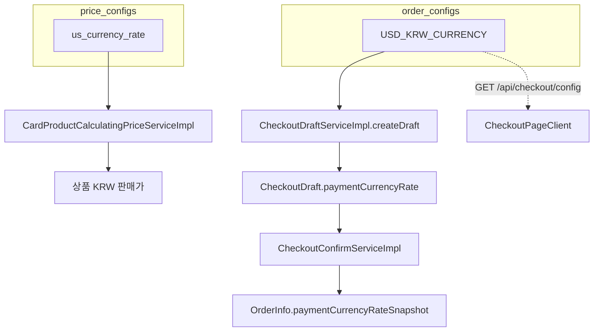

# 체크아웃 환율 설정 — 유의사항 (미결정)

> **상태**: 2026-05-27 기록. **아직 수정·통합 방향은 결정하지 않음.**  
> 새 기능·리팩터 시 아래 내용을 먼저 확인하고, `order_configs.USD_KRW_CURRENCY`를 “공식 환율”로 가정하지 말 것.

---

## 1. 요약

USD/KRW 환율이 **두 저장소·두 키**로 나뉘어 있다.

| 구분 | 테이블 | config key | 관리 UI | 용도(현재 코드) |
|------|--------|------------|---------|-----------------|
| A | `order_configs` | `USD_KRW_CURRENCY` | **없음** (주문 설정 페이지 미노출) | 체크아웃 드래프트 `paymentCurrencyRate`, 결제 화면 USD 표시 |
| B | `price_configs` | `us_currency_rate` | 관리자 **상품 설정** > 환율 변경 | 카드 상품 KRW 판매가 계산 (`CardProductCalculatingPriceServiceImpl` 등) |

**A와 B는 동기화·검증 로직이 없다.** 운영에서 B만 갱신하면 상품 가격과 결제 화면/주문 스냅샷 환율이 어긋날 수 있다.

---

## 2. `USD_KRW_CURRENCY`를 참조하는 코드 (현재)

다른 도메인 서비스(주문 관리, 가격 스케줄러, 적립 등)는 이 키를 **사용하지 않는다.** 체크아웃 경로만 사용한다.

### 백엔드

| 파일 | 동작 |
|------|------|
| `checkout/service/CheckoutDraftServiceImpl.java` | 드래프트 생성 시 `orderConfigRepository`로 `USD_KRW_CURRENCY` 조회 → `paymentCurrencyRate` 설정. 없거나 비활성·빈 값이면 `CONFIG_NOT_FOUND` (500). |
| `checkout/service/CheckoutConfirmServiceImpl.java` | 드래프트의 `paymentCurrencyRate`를 `OrderInfo.paymentCurrencyRateSnapshot`에 저장 (키 재조회 없음). |
| `checkout/controller/CheckoutController.java` | `GET /api/checkout/config` → `adminOrderService.getConfigList()` (**order_configs 전체** 반환). |

### 프론트엔드

| 파일 | 동작 |
|------|------|
| `cart/checkout/_components/CheckoutPageClient.tsx` | `/api/checkout/config` 응답에서 `configKey === "USD_KRW_CURRENCY"`만 파싱해 USD 금액 표시·`patchDraft` body에 `paymentCurrencyRate` 포함. |

### 관리자 주문 설정

| 파일 | 비고 |
|------|------|
| `admin/order/config/page.tsx` | `SHIPPING_FEE`, `FREE_SHIPPING_THRESHOLD`만 관리. **`USD_KRW_CURRENCY` 편집 UI 없음.** |

---

## 3. “참조하면 안 되는 데이터”로 보는 이유

1. **운영 경로 부재**  
   DB에만 남아 있거나 수동 INSERT된 값일 수 있고, 관리 화면·API로 일관되게 갱신되지 않는다.

2. **상품 환율과 이중화**  
   실무상 “환율”은 `price_configs.us_currency_rate`를 바꾸는 흐름이 있다. 체크아웃만 별도 키를 읽는다.

3. **체크아웃 API가 order config 전체를 노출**  
   `GET /api/checkout/config`는 배송비 설정 등과 함께 리스트를 내려준다. 환율만 필요한 클라이언트에도 order_configs 전체에 의존한다.

4. **클라이언트가 보낸 환율은 서버 patch에서 무시됨**  
   `PatchCheckoutDraftRequest.paymentCurrencyRate`는 DTO에 있으나 `CheckoutDraftServiceImpl.patchDraft`에서 **갱신하지 않는다.**  
   실제 확정에 쓰이는 값은 **드래프트 생성 시점**에 `USD_KRW_CURRENCY`로 넣은 값이다.

5. **배송비 설정 키와 별개로, order_configs 키 명명도 혼재**  
   배송비는 코드에서 `shipping_fee` / `free_shipping_threshold`(소문자)를 읽고, 관리 UI는 `SHIPPING_FEE` / `FREE_SHIPPING_THRESHOLD`(대문자)를 저장한다.  
   환율 키(`USD_KRW_CURRENCY`)도 order_configs에 묶여 있어, “주문 설정 = 배송·적립”과 “환율”의 책임이 섞여 있다.

---

## 4. 데이터 흐름 (현재)

- 상품 단가 스냅샷: 가격 계산 시점의 **판매가(KRW)** (B 영향).
- 결제 통화·환율 스냅샷: 드래프트 생성 시점의 **A** (확정 시 스냅샷).

---

## 5. 결정 전에 검토할 선택지 (메모만)

코드 변경은 **미착수**. 방향 예시:

| 방향 | 개요 |
|------|------|
| 통합 | 체크아웃도 `PriceConfigService` / `us_currency_rate`만 사용. `USD_KRW_CURRENCY` deprecate 또는 DB 행 삭제 검토. |
| API 분리 | `/api/checkout/config` 대신 환율 전용 읽기 API 또는 checkout draft 응답에 서버 계산 환율 포함. |
| 스냅샷 정책 | 주문 확정 시 환율을 “드래프트 생성 시” vs “확정 시” 중 어디에 고정할지 명시. |
| UI | order config에 넣을지, 상품 설정 환율만 쓸지, 체크아웃에서 USD 표시를 유지할지. |

---

## 6. 관련 문서·코드

- [CHECKOUT-IMPLEMENTATION-REPORT.md](./CHECKOUT-IMPLEMENTATION-REPORT.md) — draft·확정 전반 (배송비는 order_configs 사용으로 기술됨).
- `backend/.../product/service/pricing/PriceConfigServiceImpl.java` — `us_currency_rate` 상수.
- `frontend/.../admin/products/config` — 환율 변경 UI (`useAdminProductPriceConfig`).

---

## 7. 변경 이력

| 날짜 | 내용 |
|------|------|
| 2026-05-27 | 이슈 인지·미결정 상태로 유의사항 문서 최초 작성 |
