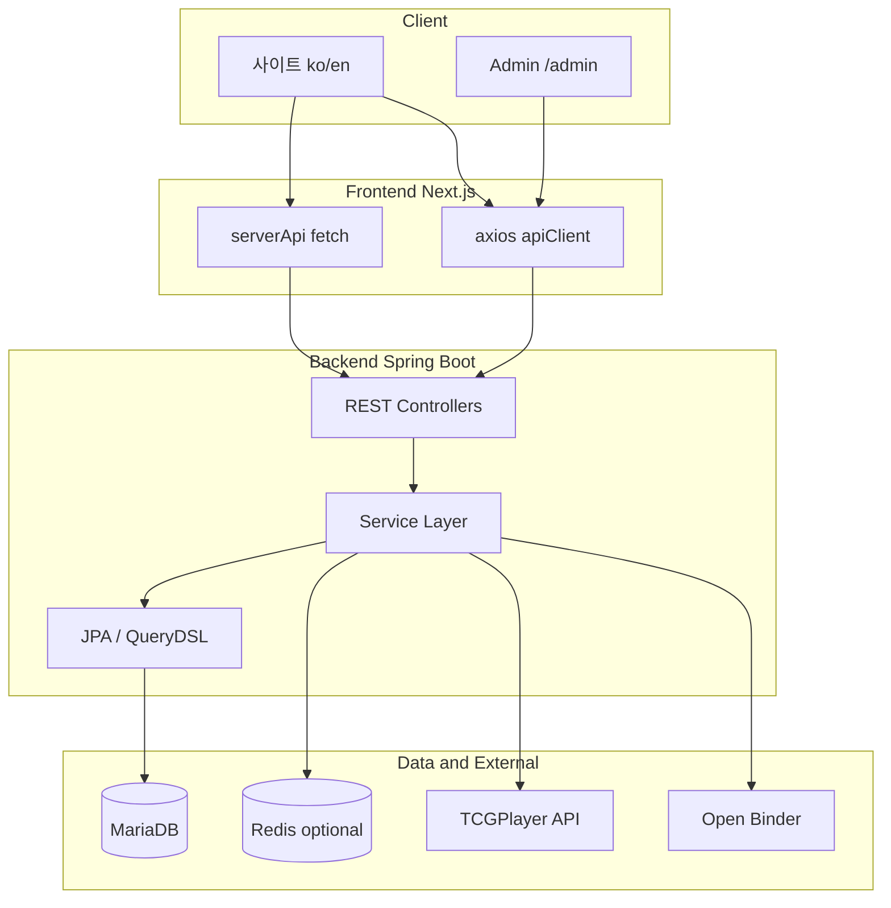
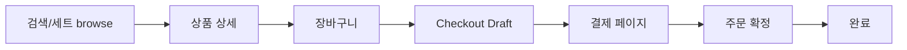
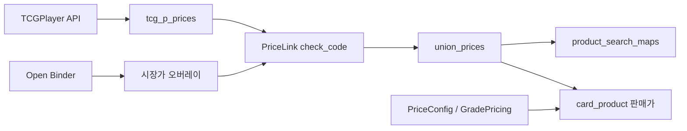

# 프로젝트 전체 구현 현황 보고서

본 문서는 **newtechtest** 온라인 TCG 카드 쇼핑몰 프로젝트의 **현재 구현 상태**를 정리한 스냅샷 보고서입니다. Git 히스토리·변천사·마이그레이션 경로는 다루지 않습니다.

---

## 1. 프로젝트 개요

### 1.1 목적

MTG, Flesh and Blood(FAB), Disney Lorcana, Star Wars Unlimited(SWU), Riftbound 등 **TCG(Trading Card Game) 싱글 카드·관련 용품**을 판매하는 온라인 쇼핑몰 및 관리자 백오피스를 제공합니다.

### 1.2 기술 스택

| 구분 | 기술 |
|------|------|
| 백엔드 | Java 17, Spring Boot 4, JPA, QueryDSL, Gradle |
| DB | MariaDB(운영·스테이징), H2(개발 기본) |
| 캐시 | Redis(선택, 검색 facet 전용) |
| 프론트엔드 | Next.js 16(App Router), React 19, TypeScript, Tailwind CSS, shadcn/ui(Radix) |
| 인증 | JWT(access·refresh), HttpOnly 쿠키 |
| 인프라 | Docker Compose, Nginx(통합 이미지) |
| 외부 연동 | TCGPlayer API, Open Binder 가격 |

### 1.3 저장소 구조

| 경로 | 역할 |
|------|------|
| `backend/` | Spring Boot REST API |
| `frontend/` | Next.js 사용자·관리자 UI |
| `docs/` | 운영·도메인별 기술 문서, DDL |
| `docker/` | 통합 Dockerfile 등 |

---

## 2. 시스템 아키텍처

### 2.1 전체 구성



### 2.2 레이어·원칙

- **흐름**: Client → Controller → Service(interface/impl) → Repository → Database
- Controller는 요청/응답만, 비즈니스·트랜잭션은 Service, 데이터 접근은 Repository
- 외부 노출 식별자는 DB PK 대신 **ULID 형태 `publicId`** (주문, 체크아웃 draft, JWT subject 등)
- 공개 상품 검색·목록은 **`product_search_maps`** 통합 인덱스 기준 (`ProductSearchMapService`)

### 2.3 핵심 데이터 개념

| 개념 | 설명 |
|------|------|
| `ProductSearchMap` | 카드(`CardProduct`), 수동상품(`ManualProduct`), Union 가격 등을 검색·장바구니·체크아웃에 통합 노출 |
| `UnionPrice` | TCG·OpenBinder 등 원천 가격을 통합한 카드 가격 마스터 |
| `CardProduct` | 실제 판매 단위(재고·등급·판매가) |
| `CheckoutDraft` | 결제 화면용 서버 스냅샷(카트와 분리) |

---

## 3. 사용자(쇼핑몰) 기능

### 3.1 구현 현황 요약

| 영역 | 상태 | 요약 |
|------|------|------|
| 홈·게임 허브 | 완료 | 메인/게임 배너, 세트 목록, 헤더 최신 세트 |
| 상품 검색·브라우즈 | 완료 | 필터·facet·키워드·게임/세트별 browse |
| 상품 상세 | 완료 | 상세 API 연동(CSR) |
| 장바구니 | 완료 | 서버 카트, `searchMapId` 기준 CRUD |
| 체크아웃·주문 | 완료 | Draft → 수정 → 확정 → 주문·재고 차감 (**PG 미연동**) |
| 로그인·회원가입 | 완료 | JWT 쿠키, refresh, Zustand 세션 |
| 마이페이지 | 부분 | 프로필·탈퇴 연동; **주문 목록/상세 미완** |
| 비밀번호 찾기 | UI만 | 페이지 존재, 백엔드 스텁 |
| 비회원 주문 확인 | UI만 | 목업 UI, API 없음 |
| Supplies / Special 메뉴 | 미구현 | 헤더 링크만, `page.tsx` 없음 |

### 3.2 주요 사용자 플로우



1. 검색·게임 허브·세트 페이지에서 상품 browse
2. 상세에서 장바구니 담기 (`searchMapId`)
3. 장바구니에서 구매 → 서버가 **Checkout Draft** 생성 → `/cart/checkout?draftId=...`
4. 결제 페이지는 draft API만 사용(다른 탭에서 카트 변경해도 스냅샷 유지)
5. 주문하기 시 서버가 가격·재고·노출 재검증 후 주문 생성·재고 차감

체크아웃·주문 확정의 상세 설계는 [CHECKOUT-IMPLEMENTATION-REPORT.md](./CHECKOUT-IMPLEMENTATION-REPORT.md) 참고.

### 3.3 프론트엔드 라우트 (사용자)

로케일 prefix: `/{locale}` (`ko` | `en`, `localePrefix: always`)

| URL | 역할 |
|-----|------|
| `/{locale}` | 홈(메인 배너) |
| `/{locale}/search` | 통합 상품 검색 |
| `/{locale}/products/[id]` | 상품 상세 |
| `/{locale}/login`, `/register` | 로그인·회원가입 |
| `/{locale}/login/forgot-password` | 비밀번호 찾기(UI) |
| `/{locale}/cart` | 장바구니 |
| `/{locale}/cart/checkout` | 결제 |
| `/{locale}/cart/checkout/complete` | 주문 완료 |
| `/{locale}/guest-order-check` | 비회원 주문 확인(UI) |
| `/{locale}/mypage/main` | 마이페이지 |
| `/{locale}/mypage/order` | 주문 목록(redirect, 대상 미구현) |
| `/{locale}/mypage/order/detail/[id]` | 주문 상세(스텁) |
| `/{locale}/game/mtg`, `.../mtg/[set]` | MTG 허브·세트 |
| `/{locale}/game/fab` | FAB 허브 |
| `/{locale}/game/lorc`, `.../lorc/[set]` | Lorcana |
| `/{locale}/game/swu`, `.../swu/[set]` | SWU |
| `/{locale}/game/rift`, `.../rift/[set]` | Riftbound |

- i18n: `frontend/src/locales/ko/common.json`, `en/common.json` (`next-intl`)
- SEO: `sitemap.ts`, `robots.ts`

---

## 4. 관리자(백오피스) 기능

### 4.1 구현 현황 요약

| 영역 | 상태 | 백엔드 prefix |
|------|------|----------------|
| 싱글카드 CRUD·엑셀·UnionPrice 동기화 | 완료 | `/api/admin/product/single-products` |
| 세트별 등록 현황 | 완료 | UI: `/admin/products/card/checkbyset` |
| 수동 상품 | 완료 | `/api/admin/product/manual-products` |
| 서플라이 마스터(제조사·분류) | 완료 | `/api/admin/product/supply-products` |
| 서플라이 상품 CRUD | 미완 | 제조사·타입만 |
| 가격·메타·동기화 | 완료 | `/api/admin/product/metadata` |
| 주문 목록·상세·배송 설정 | 완료 | `/api/admin/orders` |
| 회원·포인트·메모 | 완료 | `/api/admin/user` |
| 사이트 배너 | 완료 | `/api/admin/site-setting` |
| 동기화 로그 | 완료 | `/admin/system-log` |

### 4.2 프론트엔드 라우트 (관리자)

로케일 없음, prefix `/admin` (middleware intl 제외)

| URL | 역할 |
|-----|------|
| `/admin` | 대시보드 |
| `/admin/config` | 게임별 배너 CRUD |
| `/admin/user` | 회원·포인트·메모 |
| `/admin/system-log` | TCG/가격 동기화 로그 |
| `/admin/products` | 상품 관리 허브(안내) |
| `/admin/products/card` | 싱글카드 관리 |
| `/admin/products/card/checkbyset` | 세트별 현황 |
| `/admin/products/config` | 가격·동기화·스토리지·엑셀 |
| `/admin/products/manual-product` | 수동 상품 |
| `/admin/products/supplies` | 서플라이 마스터 |
| `/admin/order/list` | 주문 목록 |
| `/admin/order/config` | 배송비·무료배송 기준 |
| `/admin/order/detail/[id]` | 주문 상세·인쇄 |

관리자 UI는 대부분 **한국어 하드코딩**, next-intl 미사용.

### 4.3 관리자 보안 (현재 제한)

- API URL은 `/api/admin/**`로 분리
- Spring Security에 **`hasRole("ADMIN")` 미적용** — 인증된 일반 사용자도 이론상 admin API 호출 가능
- `@EnableMethodSecurity` 및 컨트롤러 메서드 권한 검증은 [WORKLIST.md](./WORKLIST.md)에 향후 과제로 명시

---

## 5. 백엔드 API·도메인

### 5.1 Public vs Authenticated

| 구분 | URL 패턴 | 비고 |
|------|-----------|------|
| Public | `/api/auth/**`, `/api/products/**`, `/card-images/**` | 상품 조회·인증 |
| Authenticated | `/api/cart`, `/api/checkout`, `/api/user`, `/api/main`, `/api/game`, `/api/mtg|fab|lorc|swu|rift`, `/api/admin/**` 등 | 로그인 필요 |
| dev 프로필 | `/**` permitAll 가능 | 로컬 개발 편의 |

### 5.2 REST 컨트롤러 전체 (25개)

#### 인증·회원·주문

| 컨트롤러 | Base path | 주요 엔드포인트 |
|----------|-----------|-----------------|
| `AuthController` | `/api/auth` | `POST /login`, `/refresh`, `/logout`, `/register` |
| `UserController` | `/api/user` | `GET /me`, `POST /withdraw`, `GET /{publicId}`, 비밀번호 관련 POST(다수 스텁) |
| `OrderController` | `/api/user/orders` | `GET /` (본인 주문 목록) |

#### 상품·검색·메인·게임

| 컨트롤러 | Base path | 주요 엔드포인트 |
|----------|-----------|-----------------|
| `ProductController` | `/api/products` | `GET /`, `/search`, `/search/init`, `/search/game/{game}/{setCode}`, `/{id}/detail` |
| `MainPageController` | `/api/main` | `GET /banners`, `/header-nav/sets` |
| `GameController` | `/api/game` | `GET /sets/{productLineId}`, `/{game}/sets/{setName}` |
| `MtgController` | `/api/mtg` | `GET /banners`, `/sets`, `/sets/{setCode}` |
| `FabController` | `/api/fab` | `GET /banners` |
| `LorcController` | `/api/lorc` | `GET /banners` |
| `SwuController` | `/api/swu` | `GET /banners` |
| `RiftController` | `/api/rift` | `GET /banners` |

#### 장바구니·체크아웃

| 컨트롤러 | Base path | 주요 엔드포인트 |
|----------|-----------|-----------------|
| `CartController` | `/api/cart` | `GET /me`, `POST/PATCH/DELETE /items/{searchMapId}`, `DELETE /items` |
| `CheckoutController` | `/api/checkout` | `POST /drafts`, `GET/PATCH /drafts/{publicId}`, `POST .../confirm`, `GET /config` |

#### 관리자 — 주문·회원·사이트

| 컨트롤러 | Base path | 주요 엔드포인트 |
|----------|-----------|-----------------|
| `AdminOrderController` | `/api/admin/orders` | `POST /list`, `GET /detail/{id}`, `GET /config`, `POST /shipping-fee`, `/free-shipping-threshold` |
| `AdminUserController` | `/api/admin/user` | `GET /list`, `/search`, `PUT /detail`, `/point`, `/memo`, 포인트 로그 |
| `AdminSiteConfigController` | `/api/admin/site-setting` | 배너 CRUD·순서 (`target`: home, mtg, fab, lorc, swu, rift) |

#### 관리자 — 상품

| 컨트롤러 | Base path | 주요 엔드포인트 |
|----------|-----------|-----------------|
| `AdminSingleProductController` | `/api/admin/product/single-products` | 카드 검색·CRUD·엑셀·UnionPrice 동기화·세트별 조회 |
| `AdminManualProductController` | `/api/admin/product/manual-products` | CRUD |
| `AdminSupplyProductController` | `/api/admin/product/supply-products` | 제조사·supply-type CRUD |
| `AdminMetadataCatalogController` | `/api/admin/product/metadata` | 카탈로그·동기화 게임 목록 |
| `AdminMetadataStorageController` | 동일 | 스토리지 CRUD |
| `AdminMetadataPricingController` | 동일 | 최소가·등급별 가격 정책 |
| `AdminMetadataSyncController` | 동일 | 메타·TCG·OpenBinder·가격 링크·Union 동기화 |
| `AdminMetadataImageController` | 동일 | TCG 이미지 다운로드 |
| `AdminProductConfigBootstrapController` | 동일 | `GET /config/bootstrap` |

패키지별 책임 상세: [BACKEND-PACKAGE-RESPONSIBILITIES.md](./BACKEND-PACKAGE-RESPONSIBILITIES.md)

### 5.3 주요 비즈니스 로직

#### 검색 (`ProductSearchMapService`)

- `product_search_maps` 기반 통합 검색·상세·facet
- `searchInit`: 첫 페이지 상품 + facet distinct 병렬 조회
- 선택적 Redis facet 캐시 (`app.cache.search-facets.enabled`, TTL 기본 60초)
- 성능·관측: [SEARCH-PERFORMANCE-IMPLEMENTATION-REPORT.md](./SEARCH-PERFORMANCE-IMPLEMENTATION-REPORT.md)

#### 가격·동기화 파이프라인



1. TCGPlayer → `tcg_p_prices`
2. Open Binder 시장가 오버레이
3. `PriceLinkService`: check_code·링크 매칭·재빌드
4. `UnionPriceIngestionService`: `union_prices` + 검색맵 동기화
5. `CardSellingPriceUpdateService` 등: `CardProduct` 판매가 반영

관리자 API 또는 스케줄러로 수동·배치 실행 가능. 동기화 중복 실행 시 409 응답.

#### 장바구니

- 회원 `userId` / 게스트 `guestId` 쿠키별 `Cart`·`CartItem`
- 아이템 키: `ProductSearchMap.id` (`searchMapId`)
- 수량 변경 시 가시 재고 검증

#### 체크아웃·주문

- Draft 스냅샷 + 확정 시 **가격·재고·노출 재검증**
- 비관적 잠금·멱등 확정, 조건부 재고 차감
- PG 없이 확정 API가 주문 마감 처리
- 게스트 주문 확인용 6자리 코드 저장

### 5.4 스케줄러

| 스케줄 | 시각 | 내용 |
|--------|------|------|
| `CardDataUpdateScheduler` | 02:00 | 메타·TCG 가격·OpenBinder·Union·판매가·이미지 |
| `StockScheduler` | 14:00 | 재고 동기화 |
| `TokenScheduler` | 3시간마다 | 만료 refresh token 정리 |

### 5.5 주요 엔티티 (약 38개)

| 도메인 | 엔티티 예 |
|--------|-----------|
| 회원 | `User`, `RefreshToken` |
| 장바구니·체크아웃 | `Cart`, `CartItem`, `CheckoutDraft`, `CheckoutDraftItem` |
| 주문 | `OrderInfo`, `OrderProduct`, `OrderConfig` |
| 검색·상품 | `ProductSearchMap`, `CardProduct`, `ManualProduct`, `GameSalesInfo` |
| 가격·카드 원천 | `UnionPrice`, `TcgPPrice`, `MtgPrice`, `FabPrice` |
| 메타 | `TcgPProductLine`, `TcgPSetName`, `Storage`, `MtgSetInfo`, `FabSetInfo` |
| 서플라이 | `Maker`, `SupplyType`, `Supply` |
| 사이트 | `Banner` |
| 로그·메일 | `SyncLog`, `PointLog`, `UserLog`, `OrderLog`, `Mail`, `MailLog` |

DDL 참고: [table/create_tables.sql](./table/create_tables.sql)

---

## 6. 프론트엔드 구조

### 6.1 API 연동 패턴

| 패턴 | 구현 | 용도 |
|------|------|------|
| SSR | `serverApi` (`src/lib/api.server.ts`) | fetch + 쿠키 `access-token`, 홈·게임 배너·검색 init |
| CSR | `api` / `apiClient` (`src/lib/api.client.ts`) | axios, `withCredentials`, 401 시 refresh 큐 |
| 상태 | TanStack Query | 장바구니, 체크아웃 draft, admin 주문 상세 등 |
| 상태 | Zustand | auth-store, (레거시) cart-store — **실제 카트는 서버 API** |

프로젝트 규칙: SSR은 fetch, CSR은 axios — 대체로 준수. 상품 상세는 클라이언트에서 `apiClient` 호출.

### 6.2 UI·라이브러리

- shadcn/ui + Radix, Tailwind CSS 3
- react-hook-form + zod (로그인·회원가입)
- embla-carousel (배너), sonner (토스트)
- TipTap (관리자 rich-text), react-to-print (주문 인쇄)
- `@tanstack/react-virtual` (admin 세트별 목록)

### 6.3 앱 구조

```
frontend/src/app/
├── [locale]/(site)/     # 사용자 쇼핑몰 (23+ page)
├── admin/               # 관리자 (13 page)
├── _components/         # AuthSessionRestorer, AppSearchBar 등
└── (meta)/              # sitemap, robots
```

---

## 7. 인증·보안

| 항목 | 내용 |
|------|------|
| JWT | access 24h, refresh 14일, HttpOnly 쿠키 |
| 갱신 | 프론트 axios 인터셉터 → `/api/auth/refresh` |
| 게스트 | `GuestIdFilter`, `guestId` 쿠키 (장바구니 설계) |
| 개인정보 | 주소·전화 AES (`app.personal-data-encryption-key`) |
| 비밀번호 | BCrypt |
| Origin | `app.security.strict-origin-check` 옵션 |
| 계정 열거 방지 | 로그인 실패 시 동일 messageCode |

---

## 8. 인프라·실행

### 8.1 로컬·Docker

| 방식 | 명령·포트 |
|------|-----------|
| 백엔드 단독 | `cd backend && ./gradlew bootRun` → :1567 |
| 프론트 단독 | `cd frontend && npm run dev` → :3000 |
| Docker 통합 | `docker compose up -d app` → :80 (Nginx) |
| Docker 분리 | backend :1567, frontend :3001, redis :6379 |

### 8.2 환경 변수 (주요)

| 변수 | 용도 |
|------|------|
| `DB_URL`, `DB_USERNAME`, `DB_PASSWORD` | MariaDB |
| `JWT_SECRET` | JWT 서명 (운영 32자+) |
| `CORS_ORIGINS` | 허용 origin |
| `PERSONAL_DATA_ENCRYPTION_KEY` | PII AES |
| `TCG_API_KEY` | TCGPlayer 동기화 |
| `REDIS_HOST`, `SEARCH_FACETS_CACHE_ENABLED` | facet 캐시(선택) |
| `NEXT_PUBLIC_API_URL` | 프론트 → 백엔드 |

### 8.3 프로필

- `dev`: H2 또는 개발 DB, 인증 완화 가능
- `demo`, `prod`: 운영 설정

운영·인수인계: [OPERATIONS.md](./OPERATIONS.md), [HANDOVER-ACTIONS.md](./HANDOVER-ACTIONS.md)

---

## 9. 미구현·제한 사항 (알려진 갭)

| 항목 | 설명 |
|------|------|
| Admin 역할 검증 | `@EnableMethodSecurity`, `hasRole("ADMIN")` 미적용 |
| PG 결제 | 실제 카드/계좌 PG 없음, 확정 API가 내부 결제 완료 처리 |
| 사용자 비밀번호 API | `UserController` update/change-password 등 스텁 |
| 마이페이지 주문 | 목록 redirect 대상 없음, 상세 API 비활성 |
| guest-order-check | 목업 UI만 |
| Admin 서플라이 상품 | 제조사·분류만, 상품 CRUD TODO |
| 헤더 Supplies/Special | 페이지 미구현 |
| 운영 감사 로그 | USER_LOGIN, ORDER_CREATED 등 [WORKLIST.md](./WORKLIST.md) 항목 미구현 |
| 달러/원 결제 표시 | 로직 정리 필요(내부 이슈 표기) |
| 키워드 FULLTEXT | LIKE 기반, 선택적 SQL 스크립트만 존재 |

---

## 10. 관련 문서 인덱스

| 문서 | 내용 |
|------|------|
| [CHECKOUT-IMPLEMENTATION-REPORT.md](./CHECKOUT-IMPLEMENTATION-REPORT.md) | 체크아웃 draft·주문 확정·재검증·멱등 |
| [SEARCH-PERFORMANCE-IMPLEMENTATION-REPORT.md](./SEARCH-PERFORMANCE-IMPLEMENTATION-REPORT.md) | 검색 성능·facet Redis·인덱스 |
| [BACKEND-PACKAGE-RESPONSIBILITIES.md](./BACKEND-PACKAGE-RESPONSIBILITIES.md) | 백엔드 패키지 책임 |
| [BACKEND-PACKAGE-GUIDELINES.md](./BACKEND-PACKAGE-GUIDELINES.md) | 패키지 배치 가이드 |
| [OPERATIONS.md](./OPERATIONS.md) | 운영 가이드 |
| [HANDOVER-ACTIONS.md](./HANDOVER-ACTIONS.md) | 인수인계 체크리스트 |
| [SEO-ROBOT-SITEMAP-GUIDE.md](./SEO-ROBOT-SITEMAP-GUIDE.md) | SEO |
| [table/create_tables.sql](./table/create_tables.sql) | MariaDB DDL |
| [README.md](../README.md) | 실행 방법 요약 |

---

*문서 기준: 코드베이스 현재 구현 스냅샷*
