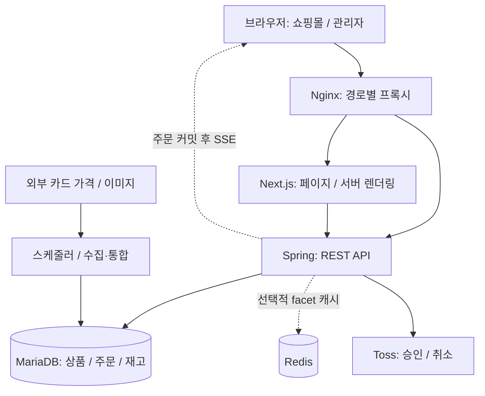

# 프로젝트 기술 학습 및 컴퓨터 과학 기반 개선 보고서

작성일: 2026-09-05 · 분석 대상: 이 저장소의 작업 트리

이 프로젝트는 TCG 카드 쇼핑몰을 중심으로 상품 검색, 외부 가격 수집, 온라인 주문·결제, 오프라인 재고, 관리자 업무를 연결하는 풀스택 시스템이다. 학습 가치가 가장 높은 부분은 **검색 데이터를 만드는 과정, 결제와 재고를 일관되게 변경하는 과정, 브라우저와 서버의 상태를 맞추는 과정**이다.

지금의 다음 단계로는 **실제 DB 기반 통합 테스트 → 스키마 변경 관리 → 성능 관측 → 결제·이벤트 복구**를 권한다. 새로운 기술을 도입할 때도 이 문제를 해결하는 순서로 접근하는 편이 좋다.

## 1. 분석 범위와 읽는 방법

의존성 선언, 대표 서비스·저장소·컨트롤러, 프론트엔드 API·상태 관리, 테스트 소스, 배포 설정을 정적으로 분석했다. 기존 미커밋 변경도 현재 코드에 포함하여 읽었다. 애플리케이션 실행, 테스트 실행, 운영 DB 조회, 실제 결제, 성능 측정은 수행하지 않았다. 따라서 아래 성능·장애 시나리오는 재현된 장애와 구분한 **설계상 검증 과제**다.

보고서의 기술 버전은 별도 표시가 없으면 의존성 파일의 선언이다. `^` 범위는 실제 설치 버전과 다를 수 있다. 신규 기술은 개념과 적용 이유를 제안하며, 설치 버전은 Spring Boot 4·Java 17 등 현재 환경과의 호환성을 별도로 확인해야 한다.

기존 README는 현재 구현과 차이가 있다.

| 기존 설명 | 현재 코드에서 확인한 사실 | 해석 |
|---|---|---|
| PG 미연동 | Toss 승인 API, 금액 검증, 주문 확정 실패 시 자동 취소, 부분 환불 관련 코드와 테스트가 존재 | 연동 코드는 존재한다. 운영 결제 검증 완료를 뜻하지는 않는다 |
| 관리자 역할 검증 미적용 | 여러 관리자 컨트롤러에 `@PreAuthorize("hasRole('ADMIN')")` 적용 | 미적용으로 일괄 평가하면 부정확하다. 엔드포인트별 누락 여부는 별도 점검 대상 |
| 운영 수동 스키마 설명에 `ddl-auto: none` 언급 | 현재 `application-prod.yml`은 `validate`, 기본·dev·demo에는 `update` 설정 | 실행 프로필별 실제 설정을 기준으로 이해해야 한다 |

## 2. 전체 구조를 먼저 이해하기



통합 Docker 구성을 개념화한 그림이다. 분리 배포 구성도 존재하며 실제 포트·경로는 배포 파일에 따라 달라진다. 백엔드는 도메인별 패키지를 나눈 단일 Spring 애플리케이션이다. 도메인 모듈의 경계가 독립 빌드나 검증 도구로 강제되는지는 별개다.

세 가지 흐름을 먼저 종이에 그릴 수 있으면 프로젝트가 훨씬 잘 보인다.

1. **상품 검색:** 외부 데이터 수집 → 통합 가격 → 판매 상품 → `ProductSearchMap` → 검색 API → 상품 목록·필터. 판매용 원본과 검색용 표현이 분리되어 있다.
2. **구매:** 장바구니 → 서버의 `CheckoutDraft` 스냅샷 → 소유자·금액·재고 검증 → Toss 승인 → DB 주문 확정·재고 차감 → 커밋 후 후속 이벤트. 확정 실패 시 결제 취소를 시도한다.
3. **관리자 변경:** 상품 변경 → DB 커밋 → 검색 맵 동기화. 주문 취소·수정은 검증, 환불, 라인 변경, 재고·포인트 조정 등의 단계로 나누어 처리한다.

## 3. 사용 기술: 무엇을 공부해야 하는가

### 3.1 프론트엔드

| 기술 | 프로젝트에서의 역할·근거 | 공부할 개념 | 직접 해볼 실습 |
|---|---|---|---|
| Next.js `^16.2.6`, React `^19.2.6` | App Router, `[locale]`, `/admin`, `api.server.ts`, `next.config.mjs` | 서버/클라이언트 컴포넌트 경계, 렌더링, hydration, 캐시, 라우팅 | 상품 페이지의 최초 HTML과 후속 브라우저 API 요청을 구분해서 기록 |
| TypeScript `^5.9.3` | 상품·주문·체크아웃 DTO와 API 래퍼 | 유니온 타입, narrowing, 제네릭, `unknown`과 런타임 검증 | 성공·실패 응답을 판별 가능한 유니온으로 설계하는 작은 예제 작성 |
| TanStack Query `^5.90.21` | `use-cart.tsx`, `use-checkout-draft.tsx`의 조회·변경·캐시 무효화 | 서버 상태, query key, stale 상태, 재조회, mutation | 장바구니 수량 변경 후 어떤 캐시가 무효화되는지 추적 |
| Zustand `^5.0.11` | 인증 상태, 세션 복원 완료 여부, SSE 상태 등 | 전역 클라이언트 상태, 구독 범위, 파생 상태 | 새 탭·새로고침·로그아웃 시 상태 변화를 표로 작성 |
| Axios `^1.13.6` + 서버 `fetch` | CSR Bearer 토큰, 쿠키 전송, 401 재발급 / SSR 인증 쿠키 읽기 | HTTP, 인터셉터, credentials, 동시 요청과 Promise | 동시에 여러 401이 발생할 때 `refreshPromise` 하나를 공유하는 이유 설명 |
| React Hook Form `^7.71.2`, Zod `^4.3.6` | 로그인·회원가입·체크아웃 폼 관련 코드 | 입력 상태, 스키마 검증, 서버 검증과의 역할 차이 | 잘못된 입력에 UI 검증과 서버 검증이 각각 어떻게 반응하는지 비교 |
| Tailwind CSS `^3.4.17`, shadcn/ui·Radix·Base UI | 공통 UI 컴포넌트와 스타일 | 디자인 토큰, 컴포넌트 조합, 접근성, 키보드 포커스 | 상품 수정 모달을 키보드만으로 사용하고 포커스 복귀 확인 |
| next-intl `^4.9.1` | ko/en 메시지, 라우팅, `proxy.ts` | locale과 통화 구분, 메시지 키, 날짜·수량 표시 | 같은 상품을 언어만 바꾸어 표시하고 가격 정책은 분리해 설명 |
| TanStack Virtual `^3.13.24` | 관리자 카드 목록 `VitualizedList.tsx` | 가상 목록, DOM 수와 데이터 수의 차이, 행 높이 | 1만 행 데이터에서 화면에 실제 생성되는 행 수 관찰 |
| Tiptap·Editor.js, Chart.js, Toss SDK | 콘텐츠 편집, 매출 그래프, 결제 UI | 외부 라이브러리 경계, 출력 데이터 형태, 번들 비용 | 두 에디터가 어떤 화면에서 사용되는지 비교해 유지 필요성 판단 |

**학습 포인트:** Zustand와 TanStack Query는 이름만 다른 상태 저장소가 아니다. 서버가 원본을 가진 장바구니·주문에는 서버 캐시의 갱신 규칙이 필요하고, 모달 열림·선택 상태에는 로컬 UI 규칙이 필요하다. 저장소에 `cart-store.ts`가 존재하지만 현재 서버 장바구니 훅도 있으므로, 실제 호출 위치를 확인하기 전 두 저장소를 모두 주 경로로 가정하면 안 된다.

또한 `api.get<T>()`의 `T`는 받은 JSON이 올바르다는 런타임 보증이 아니다. 외부 응답, 결제 응답, 복잡한 관리 기능처럼 오류 비용이 큰 경계부터 검증을 보강할 수 있다.

### 3.2 백엔드와 데이터

| 기술 | 프로젝트에서의 역할·근거 | 공부할 개념 | 직접 해볼 실습 |
|---|---|---|---|
| Java 17, Spring Boot 4.0.3 | Controller → Service → Repository, DI, 설정 프로필 | 객체 책임, 의존성 주입, 예외, 프록시 | 체크아웃 API 하나의 호출 그래프와 트랜잭션 경계 표시 |
| Spring MVC / Bean Validation | REST 요청과 응답, DTO 입력 검증 | HTTP 상태 코드, 직렬화, 입력 계약 | 400·401·403·409가 각각 어떤 실패를 나타내는지 실제 코드와 연결 |
| Spring Data JPA / Hibernate | 엔티티 저장, 연관 관계, `@Transactional` | 영속성 컨텍스트, dirty checking, flush, lazy loading, N+1 | 주문 조회 SQL 개수를 관찰하고 DTO projection과 비교 |
| OpenFeign QueryDSL 6.10.1 | `ProductSearchMapRepositoryImpl`의 동적 필터·정렬 | SQL 조합, 조인, 타입 안전성, 실행 계획 | QueryDSL 조건 하나가 생성 SQL의 어느 부분인지 대응 |
| MariaDB, H2 의존성 | 운영 관계형 DB 및 로컬/테스트 관련 구성 | PK/FK, UNIQUE, 인덱스, 격리 수준, DB 방언 차이 | 재고 차감 SQL을 격리된 MariaDB에서 동시에 실행 |
| Spring Security, JJWT 0.13.0, BCrypt | 인증 필터, 역할 검증, 비밀번호 해시, 쿠키 | 인증/인가, 해시/암호화 차이, CSRF/CORS, 토큰 만료 | 익명·일반회원·관리자 × API 권한 행렬 작성 |
| Spring Cache + Redis | 선택적 검색 facet 캐시, 기본 TTL 60초 | cache-aside, 키 정규화, TTL, 무효화, 동시 미스 | 캐시 사용 전후 DB 쿼리 수와 오래된 필터 노출 시간을 측정 |
| `CompletableFuture`, 전용 스레드 풀 | facet 조회를 여러 DB 작업으로 분산 | 스레드/커넥션 풀, 큐, backpressure, 예외 전파 | 풀 크기를 바꾸며 응답 지연과 DB 대기 시간을 함께 비교 |
| WebClient / WebFlux 의존성 | Toss와 외부 데이터 API 호출 | 비동기 I/O, timeout, blocking과 nonblocking | `.block()` 호출이 어느 스레드를 기다리게 하는지 추적 |
| Spring 이벤트·스케줄러, SSE | 커밋 후 검색 갱신·주문 알림, 정기 수집 | 트랜잭션 이벤트, 재시도, 연결 수명, 프로세스 상태 | 주문 커밋 후 알림이 발송되는 시점과 재시작 시 동작을 설명 |
| Apache POI, OpenCSV, Tika, Mail·Thymeleaf | 엑셀·CSV·파일 관련 기능 및 메일 의존성 | 스트리밍 처리, 메모리 사용, 입력 파일 검증, 템플릿 | 큰 파일 업로드의 파싱·검증·저장 단계를 분리해 설계 |

WebFlux 의존성과 WebClient 사용만으로 전체 시스템이 reactive 구조인 것은 아니다. 확인한 외부 호출에는 `.block()`이 있고 주 저장 방식은 JPA다. 이 구조에서 중요한 것은 무조건 reactive로 바꾸는 일이 아니라 **대기 시간과 동시 처리량을 관리하는 것**이다.

빌드 파일에는 `spring-boot-starter-web`, `poi-ooxml` 중복 선언과 Jackson 2/3 계열 관련 설정이 보인다. 중복 선언이 곧 런타임 충돌이라는 뜻은 아니며, Gradle 의존성 분석으로 실제 선택 버전과 기존 고정 이유를 확인한 뒤 정리해야 한다.

### 3.3 빌드·배포·테스트

| 기술·구성 | 현재 확인한 내용 | 학습 포인트 |
|---|---|---|
| Gradle Kotlin DSL | Java 컴파일, QueryDSL annotation processor, JUnit Platform, 기본 test에서 `*IT` 제외 | 빌드 단계, 의존성 해석, 단위·통합 테스트 분리 |
| npm lockfile, ESLint | `npm ci`, build, lint 스크립트 | 재현 가능한 설치와 정적 분석의 한계 |
| Docker 멀티스테이지, Next standalone | 빌드 이미지와 런타임 구분, 통합 이미지에 Java·Node·Nginx | 프로세스 종료, 헬스체크, 이미지 크기, 환경 변수 주입 시점 |
| Docker Compose / Nginx | 통합·분리 구성, 경로별 프록시 | 컨테이너 네트워크, 내부/외부 포트, TLS 종료, 스트리밍 버퍼링 |
| JUnit·Mockito·AssertJ·Web MVC 테스트 | 결제 금액·취소, 주문 조정, 포인트, 인증 등 테스트 소스 존재 | mock으로 검증하는 것과 실제 DB에서만 확인 가능한 것 구분 |

프론트엔드 `package.json`에서 전용 테스트 스크립트는 확인하지 못했다. `.github` 디렉터리도 현재 작업 트리에 없다. 이는 저장소 안에서 해당 CI 구성을 발견하지 못했다는 뜻이며 외부 CI 서비스의 부재를 확정하지 않는다. 통합 Dockerfile은 백엔드 빌드 시 `-x test`를 사용하므로 이미지 생성 성공을 테스트 통과로 해석할 수 없다.

## 4. 이미 잘 적용된 설계와 확장할 지점

### 4.1 재고 경쟁과 중복 주문을 이미 고려했다

`CheckoutDraftRepository.findByPublicIdForUpdate()`는 비관적 쓰기 잠금을 사용한다. `finalizeAfterPayment()`는 이미 확정된 draft에 기존 주문을 반환한다. 재고 차감 전에는 테이블 종류·상품 ID 순으로 처리 순서를 정렬한다. 카드 재고는 다음 형태의 조건부 UPDATE로 차감한다.

```sql
UPDATE card_product
SET current_visible_stock = current_visible_stock - :qty,
    total_stock = total_stock - :qty
WHERE id = :id
  AND current_visible_stock >= :qty
  AND is_visible = true
  AND (is_deleted = false OR is_deleted IS NULL);
```

이 SQL은 현재 코드에서 발췌한 학습 예시다. 실습은 별도 테스트 DB에서 해야 한다. 먼저 읽고 Java에서 재고를 계산한 뒤 덮어쓰는 방식과 달리, DB가 조건 확인과 수정을 한 문장으로 수행한다. 영향 행 수 0을 실패로 다루는 것이 핵심이다.

따라서 “락을 추가하자”보다 **서로 다른 draft가 마지막 재고를 경쟁할 때, 여러 상품 중 중간 차감이 실패할 때, 주문 재요청이 들어올 때 결과가 정확한지**를 테스트하는 일이 우선이다. 일정한 잠금 순서는 교착 가능성을 낮추지만 시스템의 모든 경로에서 교착이 사라진다는 보장은 아니다.

### 4.2 금액 검증은 불변식으로 접근하고 있다

`verifyAmountInvariants()`는 라인 금액, 소계, 배송비, 포인트, 최종 금액을 재검산한다. `BigDecimal`도 사용한다. 이 설계를 기반으로 반올림 정책·환불 누계·음수 수량·통화 단위를 명확하게 만들 수 있다. “금액 계산 함수를 추가한다”보다 **어떤 요청 순서에서도 유지되어야 하는 식을 정한다**는 관점이 중요하다.

### 4.3 도메인 변형을 처리하는 구조가 있다

상품 종류마다 `CheckoutLineHandler`를 구현하고 registry로 선택한다. 주문 변경은 `OrderAdjustmentOrchestrator`와 개별 step으로 나뉜다. 이는 다형성과 책임 분리를 배우기 좋은 사례다. 다음 단계는 클래스를 더 쪼개는 일이 아니라 각 단계의 입력·출력·실패·트랜잭션 경계를 명시하는 것이다.

### 4.4 검색 읽기 모델과 커밋 후 처리가 있다

`ProductSearchMap`은 여러 판매 원본을 검색하기 좋은 형태로 묶은 읽기 모델로 볼 수 있다. 검색 갱신은 `AFTER_COMMIT` 이벤트와 `REQUIRES_NEW` 서비스로 나뉜다. 이는 원본 수정과 검색 표현을 분리하는 합리적인 출발점이다. 다만 원본 커밋과 후속 갱신 사이에 프로세스가 종료되면 생기는 간극을 다루는 복구 체계까지 확인해야 한다.

## 5. 추가 도입을 권하는 기술·설계

P1은 먼저 시작할 기반 작업, P2는 기반 위에 진행할 신뢰성 개선, P3는 운영 요구와 측정 결과에 따라 선택할 항목이다. 비용은 이 프로젝트에 대한 상대적 추정이며 일정 약속이 아니다.

| 우선순위 | 기술·설계 | 이 프로젝트에 필요한 이유 | 최소 도입 범위 / 완료 기준 | 비용·주의점 |
|---|---|---|---|---|
| P1 | **Testcontainers + MariaDB** | 현재 Mockito 결제 테스트로 실제 잠금·SQL·롤백을 확인할 수 없음 | 마지막 재고 경쟁, 동일 draft 중복 확정, 중간 실패 롤백을 실제 DB로 검증 | 중간. Docker 실행 환경과 운영에 맞춘 DB 버전 필요 |
| P1 | **Flyway** | 프로필별 update/validate와 수동 DDL의 차이 관리 | 현재 스키마 baseline 검토 → 이후 변경을 버전 SQL로 관리 → 빈 DB와 기존 DB 업그레이드 모두 검증 | 중간. 실제 운영 스키마를 확인하기 전 baseline을 자동 적용하지 않기 |
| P1 | **Actuator + Micrometer** | 검색 시간 로그는 있으나 시스템 전체 병목을 관찰할 기반 필요 | 검색 p95, HTTP 오류율, DB 풀 대기, facet 큐, PG 지연·보상 실패 계측 | 낮음~중간. 운영용 관리 엔드포인트의 접근 범위를 함께 설계 |
| P1 | **CI 테스트 게이트** | Docker 빌드는 테스트를 생략하며 저장소 내 CI 파일을 찾지 못함 | backend test, 격리 DB 통합 테스트, frontend lint·build를 배포 이전에 실행 | 중간. 외부 API·운영 DB 없이 재현되게 구성 |
| P2 | **결제 작업 이력 + 상태 머신 + 대사 작업** | 승인·DB 확정·취소가 서로 다른 시스템에서 실행됨 | 작업 ID·멱등키·요청 금액·결과 미확정 상태를 저장하고 PG 조회로 복구 | 높음. 재시도를 추가하기 전에 동일 작업과 새 작업을 구분 |
| P2 | **Transactional Outbox 또는 Spring Modulith 이벤트 영속화 검토** | 현재 프로세스 내 커밋 후 이벤트의 실패·재시작 복구 보강 | 상품 수정과 후속 작업 기록을 같은 트랜잭션에 저장; 실패 작업 재처리 | 중간~높음. Kafka 없이 DB poller부터 시작 가능; 중복 처리 방지 필요 |
| P2 | **Playwright** | 세션 복원·locale·장바구니·결제 화면을 이어서 검증할 필요 | 회원/비회원 구매, 새로고침, 금액 변경, 실패 복귀 경로 E2E | 중간. 내부 흐름은 모의 PG로, 별도 PG 테스트 환경 검증은 분리 |
| P2 | **OpenAPI + 타입 생성** | Java DTO와 TS DTO를 수동으로 맞추는 부담 | 먼저 상품 검색·체크아웃 계약을 문서화하고 타입 변화 검출 | 중간. `ResponseEntity<?>`의 여러 응답 형태를 명시해야 효과가 큼 |
| P2 | **명시적 timeout + 제한된 재시도 / Resilience4j 검토** | Toss 클라이언트에 명시적 timeout 설정이 보이지 않고 `.block()` 사용 | 외부 조회부터 timeout·오류 분류·재시도 상한 설정 | 중간. 결제 변경 요청은 결과 조회·멱등성 정책 없이 자동 재시도하지 않기 |
| P3 | **전문 검색 엔진** | 부분 문자열 검색·facet이 측정상 한계에 도달하거나 오타·동의어 검색이 요구될 때 | 실제 검색어로 MariaDB 개선안과 정확도·지연·운영비 비교 | 높음. 인덱스 동기화 지연, 재색인, 한글·카드명 처리 검증 필요 |
| P3 | **객체 스토리지/CDN, 프로세스 분리 확대** | 이미지 용량·트래픽 또는 앱별 독립 배포 요구가 커질 때 | 이미지 업로드·제공 경로와 백업, 독립 헬스체크 정리 | 중간. 기존 Compose 분리 구성을 먼저 활용 가능 |

Testcontainers는 MariaDB 모듈을 제공하고, Flyway의 baseline 명령은 기존 DB를 마이그레이션 관리의 출발점으로 등록하는 기능이다. 위 우선순위와 적용 범위는 저장소를 근거로 한 제안이다. [Testcontainers MariaDB 문서](https://java.testcontainers.org/modules/databases/mariadb/), [Flyway baseline 문서](https://documentation.red-gate.com/flyway/reference/commands/baseline)

Actuator는 Micrometer 기반 지표 수집을 지원한다. Playwright는 브라우저 테스트 도구이고, springdoc은 Spring 애플리케이션의 OpenAPI 문서화를 지원한다. 설치 전 현재 Boot 4 환경에 맞는 조합을 확인한다. [Spring Boot metrics](https://docs.spring.io/spring-boot/reference/actuator/metrics.html), [Playwright 시작하기](https://playwright.dev/docs/intro), [springdoc 공식 문서](https://springdoc.org/)

Spring Modulith는 이벤트 발행 기록과 재처리 기능을 제공하므로 현재 Spring 이벤트 구조의 확장 후보가 된다. 직접 구현한 outbox와 둘 다 도입할 필요는 없다. Resilience4j는 재시도·차단·동시성 제한 등을 구성할 때 검토할 수 있다. [Spring Modulith 이벤트](https://docs.spring.io/spring-modulith/reference/events.html), [Resilience4j 소개](https://resilience4j.readme.io/docs/getting-started)

**당장 보류할 것:** 트래픽·조직·운영 요구가 확인되지 않은 상태의 마이크로서비스 전환, Kubernetes, Kafka 전면 도입. 현재 구조에서 프로세스와 데이터 일관성의 문제가 해결되지 않으면 서비스를 나누면서 네트워크 실패 지점만 늘어날 수 있다. Java나 프레임워크의 대규모 업그레이드도 구체적인 필요와 호환성 검증을 전제로 판단하는 편이 좋다.

## 6. 컴퓨터 과학을 배웠다면 무엇을 더 잘 만들 수 있었을까

컴퓨터 과학을 배우지 않았다고 이 프로젝트의 설계 능력이 부족하다고 단정할 수는 없다. 이미 조건부 UPDATE, 멱등 주문 확정, 금액 불변식, 다형성, 이벤트 분리처럼 CS와 연결되는 설계가 있다. CS를 체계적으로 공부하면 **이 설계가 어떤 조건에서 안전하고 어디서 깨지는지 설명·검증하는 능력**을 더할 수 있다.

### 6.1 데이터베이스: 재고가 정확한 쇼핑몰

**배울 것:** ACID, 격리 수준, MVCC, 행 잠금, 교착, 트랜잭션 경계.

**현재 연결점:** draft 잠금, 조건부 재고 차감, 일정한 차감 순서, `@Transactional`.

**더 잘 만들 수 있는 것:** 마지막 한 장에 두 주문이 들어와도 한 주문만 성공하는 시스템, 실패한 주문의 재고·포인트가 함께 복구되는 시스템.

**실습:** 초기 재고 1에 서로 다른 draft의 확정을 동시에 요청한다. 성공 주문 수=1, 최종 재고=0, 실패 주문의 포인트 변화=0을 확인한다. 이어서 상품 두 개 중 두 번째 상품의 재고 부족을 유도하고 첫 번째 차감도 롤백되는지 확인한다. 단순 mock 대신 실제 MariaDB를 쓴다.

### 6.2 분산 시스템: 결제 결과가 불명확해도 복구되는 주문

**배울 것:** 부분 실패, 멱등성, 재전송, at-least-once 처리, 보상 트랜잭션, 상태 머신.

**현재 연결점:** `TossPaymentServiceImpl`은 승인 후 주문 확정을 수행하며 실패 시 취소한다. `TossPaymentsApiClient`는 명시적 키가 없으면 호출마다 UUID 멱등키를 만든다. 전액 환불에는 주문 기반 키가 있지만, 부분 환불에는 새 UUID를 생성하는 경로가 있다.

**보완점:** 동일한 논리 작업의 재시도에 동일 키를 다시 사용하도록 작업 이력에 저장한다. 서로 다른 부분 환불은 서로 다른 작업 ID를 사용한다. “헤더가 존재한다”와 “재시작 후에도 같은 작업임을 식별한다”는 다른 보장이다. 현재 코드만으로 이중 결제가 실제 발생한다고 단정할 수는 없지만, 재시도·장애 주입 검증이 필요하다.

특히 다음 세 경우를 구분해야 한다.

| 상황 | 필요한 판단 |
|---|---|
| PG 승인 성공 직후 서버 종료 | PG 조회와 저장된 작업 이력으로 승인 여부를 확인하고 주문 확정 또는 취소 복구 |
| PG 요청 timeout | 실패로 확정하지 말고 결과 미확정 상태로 보관하여 대사 |
| PG 취소 성공 후 DB 커밋 실패 | 외부 취소는 DB 롤백으로 되돌릴 수 없으므로 환불 상태와 내부 주문 상태를 다시 맞춤 |

마지막 경우는 `@Transactional`인 주문 조정 파이프라인 안에 환불 step이 있다는 점과 직접 연결된다. PG 호출을 짧은 DB 상태 전이 사이에 배치하고 복구 가능한 작업으로 다루는 설계를 검토할 수 있다.

**더 잘 만들 수 있는 것:** 고객이 재시도하거나 서버가 재시작되어도 결제·주문 상태를 추적하고 복구할 수 있는 상점. 처음에는 `REQUESTED / UNKNOWN / SUCCEEDED / COMPENSATION_PENDING / COMPENSATED` 같은 상태를 설계 초안으로 두고 전이 조건을 정의한다. 이는 현재 구현된 상태 목록이 아니다.

웹훅은 상태 변경을 받을 수 있는 보완 수단이다. 이벤트별 공식 검증 방식, 중복·순서 뒤바뀜, 누락 시 PG 조회를 함께 설계해야 한다. 웹훅만 추가한다고 복구가 완성되지는 않는다. [Toss 웹훅 연결 문서](https://docs.tosspayments.com/guides/v2/webhook)

### 6.3 자료구조·알고리즘: 데이터가 늘어도 예측 가능한 검색

**배울 것:** 시간·공간 복잡도, B-tree, 해시, 역색인, 정렬 비용, 집합 연산.

**현재 연결점:** 검색 저장소의 `containsIgnoreCase`, offset/limit, facet DISTINCT 조회, 검색 결과를 바탕으로 한 ID 목록 전달.

**보완점:** 부분 문자열 검색은 일반 B-tree 인덱스로 효율적인 범위 탐색을 하기 어려운 경우가 많다. 깊은 offset 페이지는 건너뛸 행이 늘어난다. facet 계산을 위해 많은 ID를 애플리케이션으로 가져오는 경로는 전송량·메모리·IN 조건 크기를 점검해야 한다.

**실습:** 동일 스키마에 1만/10만/100만 건의 합성 데이터를 만들고 첫 페이지·깊은 페이지·키워드 유무를 비교한다. `EXPLAIN`, 검사 행 수, 반환 행 수, 쿼리 수, p95를 기록한다. 동등 조건·정렬 순서를 고려한 인덱스, DB 내부 JOIN/집계, 안정적인 ID 보조 정렬을 포함한 keyset 페이지네이션을 비교한다. 페이지 번호 직접 이동이 필요한 관리자 UI에서는 offset의 편의성도 비용과 함께 평가한다.

**더 잘 만들 수 있는 것:** “대충 느리다” 대신 어느 쿼리가 왜 느린지 설명하고, 검색 엔진 도입이 정말 필요한 시점을 판단하는 검색 기능. 실제 데이터 분포와 실행 계획 없이 특정 복합 인덱스를 정답으로 확정하지 않는다. [MariaDB EXPLAIN](https://mariadb.com/docs/server/reference/sql-statements/administrative-sql-statements/analyze-and-explain-statements/explain), [인덱스 가이드](https://mariadb.com/docs/server/mariadb-quickstart-guides/mariadb-indexes-guide)

### 6.4 운영체제·큐잉: 동시에 접속해도 버티는 서버

**배울 것:** 스레드, blocking I/O, 자원 풀, 대기열, 포화, 처리량과 지연의 관계.

**현재 연결점:** facet 풀은 core=4, max=8, queue=200이다. 초기 병렬 작업 7개에 더해 조건에 따라 후속 작업이 최대 3개 추가된다. 운영 설정의 DB 풀은 15다. `searchInit()`은 첫 상품 페이지 조회 후 facet을 호출하므로 전체 초기 검색이 모두 병렬인 것도 아니다.

**보완점:** 한 요청에서 독립 쿼리를 병렬화하면 단일 사용자 지연은 줄어도 전체 DB 작업량이 줄지는 않는다. 요청 트랜잭션이 기다리는 동안 보유하는 자원, worker의 DB 커넥션 대기, 큐 적체를 함께 관찰해야 한다. 실제 포화 여부는 부하 테스트로 판단한다.

**실습:** 동시 요청 수를 단계적으로 늘려 p50·p95·p99, 오류율, DB 활성/대기 연결, facet 큐 길이를 함께 기록한다. 스레드 수를 늘리는 실험뿐 아니라 쿼리를 줄이는 실험도 한다.

**더 잘 만들 수 있는 것:** 느려졌을 때 스레드를 무작정 늘리지 않고, 적정 동시성·timeout·부하 제한을 정할 수 있는 서버.

### 6.5 일관성 모델: 검색·알림·원본이 어긋나도 회복하는 시스템

**배울 것:** 정규화/비정규화, 읽기 모델, eventual consistency, durable queue, 재처리와 중복 방지.

**현재 연결점:** 검색 맵은 원본과 별도로 저장되고, 커밋 후 이벤트로 갱신된다. SSE 연결은 `ConcurrentHashMap`에 있으며 미접속 시 알림은 건너뛴다.

**보완점:** 검색은 허용 가능한 지연 시간을 정하고 재색인·대사 경로를 둔다. SSE는 화면에 빠르게 알리는 채널로 사용하고, 반드시 확인해야 하는 업무는 DB의 주문 목록·미확인 상태에서 복원되게 한다. 서버가 여러 대가 되면 한 프로세스의 emitter와 이벤트는 다른 서버에 자동 공유되지 않는다.

**실습:** 원본 커밋 직후 프로세스를 종료하는 장애 실험을 설계하고, 재시작 후 outbox 재처리로 검색 맵이 따라오는지 확인한다. 같은 이벤트를 두 번 처리해도 재고가 두 번 차감되지 않아야 한다.

### 6.6 네트워크·보안: 로그인 상태와 권한을 정확히 다루는 서비스

**배울 것:** HTTP, origin/site, 쿠키 속성, 인증과 인가, 신뢰 경계, 프록시, 스트리밍.

**현재 연결점:** access/refresh 쿠키, 클라이언트 메모리 토큰, `withCredentials`, 서버 쿠키 읽기, 메서드 역할 검증, IP 기반 Bucket4j 제한이 있다.

**보완점:** SSR과 CSR에서 누구의 인증 정보를 사용하는지, 로그아웃 후 세션이 복원되지 않는지 확인한다. 역할 검증과 별도로 주문·draft 소유권을 테스트한다. CSRF 비활성화 자체만으로 취약하다고 단정하지 않고, 실제 쿠키 인증 경로·SameSite·origin 검증을 함께 검토한다.

`AuthRateLimitInterceptor`는 메모리 Map을 사용하고 확인한 코드에는 항목 만료 제거가 없다. 장기간 다양한 IP 유입에 대한 메모리 관리와 여러 서버 간 제한 정책을 정할 수 있다. 또한 `X-Forwarded-For`의 첫 값을 사용하므로 실제 프록시가 신뢰 가능한 값을 구성하는지 확인해야 한다. Nginx와 Next를 거치는 SSE에는 버퍼링·연결 timeout의 영향도 있다.

**더 잘 만들 수 있는 것:** 로그인 여부를 화면에서만 판단하지 않고 API 권한·소유권까지 일관되게 검증하며, 배포 방식이 바뀌어도 인증이 유지되는 서비스.

### 6.7 수학·타입·소프트웨어 공학: 변경해도 금액과 정책이 흔들리지 않는 코드

**배울 것:** 불변식, 상태 전이, 단위와 값 객체, 부동소수점, 순수 함수, 계약·속성 테스트.

**현재 연결점:** `BigDecimal`, 금액 불변식, 포인트 계산기, 상품 종류별 handler, 주문 변경 step.

**보완점:** 금액에는 통화와 반올림 정책을, 수량에는 양수 조건을, 주문 상태에는 허용 전이를 명시한다. API 전달에는 원 단위 정수 또는 계약된 문자열 소수를 사용하고 프론트 표시 계산을 서버의 최종 권위와 구분한다. 여러 부분 환불의 합이 승인 금액을 넘지 않는 식을 테스트한다.

**실습:** “사용 포인트는 음수가 아니다”, “환불 누계 ≤ 승인 금액”, “취소를 반복해도 재고 복원은 한 번”을 무작위 입력·요청 순서로 검증하는 테스트를 설계한다. 처음에는 기존 JUnit 반복 테스트만으로 시작해도 된다.

**더 잘 만들 수 있는 것:** 새 게임·상품 종류·할인 정책을 추가할 때 기존 주문·환불 계산이 깨졌는지 빠르게 알아내는 코드.

## 7. 8주 학습 계획

주당 6~8시간을 가정한 예시다. Java·JavaScript 문법, 함수·클래스·배열·Map, 기본 SQL JOIN, HTTP 요청/응답이 익숙하지 않다면 먼저 보충한다. 각 주는 개념 학습 → 코드 추적 → 작은 실험 → 결과 기록 순서로 진행한다.

| 주차 | 집중 주제 | 이 프로젝트로 만들 학습 결과물 |
|---|---|---|
| 1 | 전체 구조, React/Next 렌더링, REST | 상품 검색 요청의 브라우저→서버→DB 흐름도와 실제 네트워크 기록 |
| 2 | TypeScript, Query/Zustand, 인증 | 토큰 재발급·로그아웃·캐시 갱신 상태표, 중복 요청 실험 |
| 3 | Spring DI, JPA, SQL | 체크아웃 호출 그래프, 트랜잭션·flush 시점과 SQL 관찰 노트 |
| 4 | DB 동시성, 통합 테스트 | 마지막 재고 경쟁·중간 실패 롤백·동일 draft 재요청 테스트 |
| 5 | 인덱스, 검색, 스레드/DB 풀 | 데이터 크기·동시성별 검색 지표 표와 최적화 전후 비교 |
| 6 | 분산 시스템, 결제 상태 | 승인/timeout/취소 실패 상태도, 안정적인 작업 ID 설계와 장애 실험 |
| 7 | Flyway, CI, 관측 | 빈 DB 재구성·기존 DB 변경 검증, 테스트 게이트, 핵심 지표 초안 |
| 8 | E2E, 이벤트 복구, 설계 문서 | 회원/비회원 구매 시나리오, 검색 맵 재처리 실험, 설계 결정 기록 |

## 8. 먼저 작성할 개선 과제 5개

1. **체크아웃 동시성 테스트:** 다른 draft 간 재고 경쟁, 같은 draft 반복 확정, 중간 실패 롤백을 격리 MariaDB에서 검증한다. 성공 주문 수·재고·포인트를 함께 확인한다.
2. **PG 작업 이력 설계:** 승인·전액/부분 취소별 논리 작업 ID와 멱등키를 보관하고, 응답 미확정 상태에서 PG 조회로 복구하는 시나리오를 문서화한다.
3. **검색 성능 기준선:** 동일 데이터와 요청 조건에서 상품 쿼리·facet 쿼리·캐시 hit/miss·DB 풀 대기를 측정한다. 개선 목표 수치는 이 기준선과 사용자 요구를 보고 정한다.
4. **스키마 재현성 확보:** 운영 스키마와 DDL 차이를 확인하고 Flyway baseline 및 이후 변경 절차를 테스트 DB에서 검증한다.
5. **자동 검증과 문서 동기화:** 기존 테스트·새 통합 테스트·프론트 lint/build를 배포 전 실행하고 README의 결제·권한·프로필 설명을 현재 코드와 맞춘다.

## 9. 코드 읽기 바로가기

아래 링크는 분석한 로컬 작업 트리를 가리킨다. 코드가 바뀌면 이 보고서의 평가도 다시 확인해야 한다.

| 학습 주제 | 읽을 파일 |
|---|---|
| 의존성 | [프론트 package.json](/frontend/package.json), [백엔드 build.gradle.kts](/backend/build.gradle.kts) |
| 서버/브라우저 API | [api.server.ts](/frontend/src/lib/api.server.ts), [api.client.ts](/frontend/src/lib/api.client.ts) |
| 상태와 캐시 | [auth-store.ts](/frontend/src/stores/auth-store.ts), [use-cart.tsx](/frontend/src/hooks/use-cart.tsx), [use-checkout-draft.tsx](/frontend/src/hooks/use-checkout-draft.tsx) |
| 주문 확정과 잠금 | [CheckoutConfirmServiceImpl.java](/backend/src/main/java/com/shop/checkout/service/CheckoutConfirmServiceImpl.java), [CheckoutDraftRepository.java](/backend/src/main/java/com/shop/checkout/repository/CheckoutDraftRepository.java) |
| 원자적 재고 차감 | [CardProductRepository.java](/backend/src/main/java/com/shop/product/repository/card/CardProductRepository.java:341) |
| 결제·복구 | [TossPaymentServiceImpl.java](/backend/src/main/java/com/shop/checkout/service/TossPaymentServiceImpl.java), [TossPaymentsApiClient.java](/backend/src/main/java/com/shop/checkout/client/TossPaymentsApiClient.java) |
| 주문 수정·환불 | [OrderAdjustmentOrchestrator.java](/backend/src/main/java/com/shop/order/adjustment/OrderAdjustmentOrchestrator.java), [OrderPaymentRefundService.java](/backend/src/main/java/com/shop/order/adjustment/service/OrderPaymentRefundService.java) |
| 검색 SQL | [ProductSearchMapRepositoryImpl.java](/backend/src/main/java/com/shop/search/repository/ProductSearchMapRepositoryImpl.java) |
| 검색 병렬 처리 | [CachedSearchFacetLoader.java](/backend/src/main/java/com/shop/search/service/CachedSearchFacetLoader.java), [SearchFacetExecutorConfig.java](/backend/src/main/java/com/shop/config/SearchFacetExecutorConfig.java) |
| 이벤트와 읽기 모델 | [ProductSearchMapEventListener.java](/backend/src/main/java/com/shop/search/listener/ProductSearchMapEventListener.java), [ProductSearchMapServiceImpl.java](/backend/src/main/java/com/shop/search/service/ProductSearchMapServiceImpl.java) |
| 알림 | [AdminOrderAlarmEventListener.java](/backend/src/main/java/com/shop/admin/alarm/listener/AdminOrderAlarmEventListener.java), [AdminAlarmServiceImpl.java](/backend/src/main/java/com/shop/admin/alarm/service/AdminAlarmServiceImpl.java) |
| 인증·인가 | [SecurityConfig.java](/backend/src/main/java/com/shop/common/config/SecurityConfig.java), [AuthController.java](/backend/src/main/java/com/shop/auth/controller/AuthController.java), [AdminOrderController.java](/backend/src/main/java/com/shop/admin/order/controller/AdminOrderController.java) |
| 요청 제한 | [AuthRateLimitInterceptor.java](/backend/src/main/java/com/shop/security/AuthRateLimitInterceptor.java) |
| 현재 결제 테스트 | [TossPaymentServiceImplTest.java](/backend/src/test/java/com/shop/checkout/service/TossPaymentServiceImplTest.java) |
| 배포와 스키마 | [Dockerfile](/docker/Dockerfile), [nginx.conf](/docker/nginx.conf), [운영 프로필](/backend/src/main/resources/application-prod.yml), [DDL](/docs/table/create_tables.sql) |

이 보고서의 성과 판단 기준은 기술 이름을 얼마나 많이 익혔는지가 아니다. **재고 1개를 두 사람이 주문하면 어떤 SQL과 잠금 때문에 한 사람만 성공하는지, 결제 도중 서버가 종료되면 무엇을 근거로 복구하는지, 검색이 느려지면 어떤 지표부터 확인하는지**를 자신의 코드로 설명하고 실험할 수 있는지가 기준이다.
